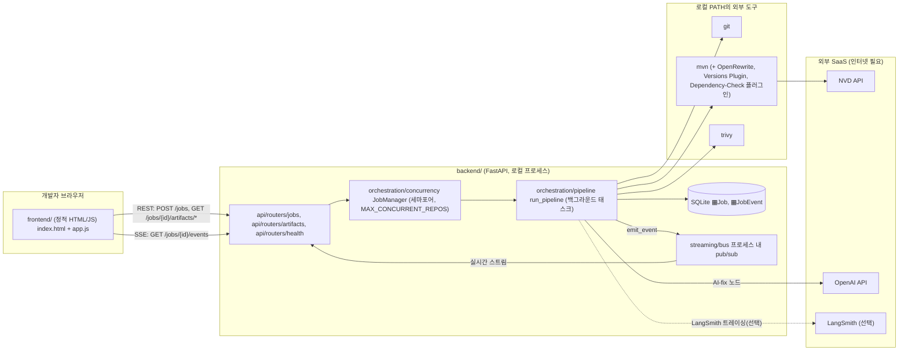
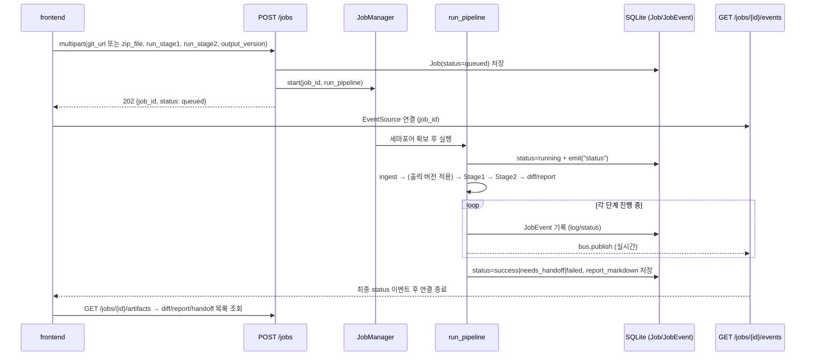
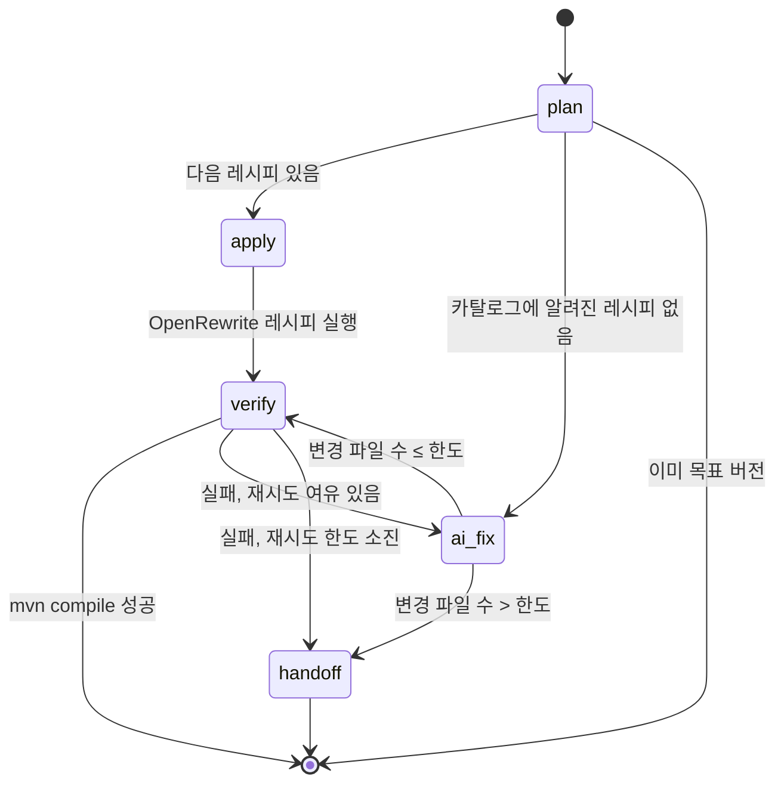
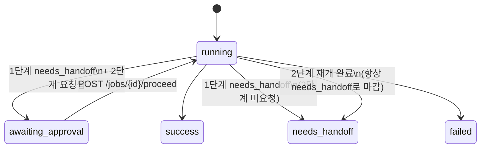
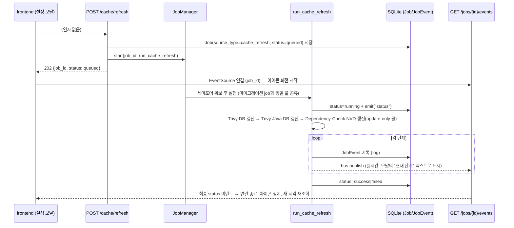
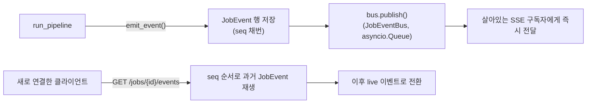

# Maven Stack Upgrade Tool — 아키텍처

- 작성일: 2026-08-07
- 이 문서는 실제 구현(`backend/`, `frontend/`)을 기준으로 정리한 아키텍처 문서다. 설계 배경/의사결정 근거는 [`docs/superpowers/specs/2026-08-06-oss-dependency-governance-design.md`](superpowers/specs/2026-08-06-oss-dependency-governance-design.md)(이하 "설계 스펙")를 참고한다. 이 문서는 그 스펙이 실제로 어떤 모듈/파일로 구현됐는지를 코드 기준으로 매핑한다.

## 1. 한 줄 요약

임의의 Maven(Java) 프로젝트를 Git URL 또는 ZIP으로 입력받아, **Java 21 / Spring Boot 4.1 / Spring Cloud 2025.1 / Spring AI 2.0**으로 단계적으로 마이그레이션하고(1단계, 필수), 이후 남은 개별 OSS 취약점을 스캔·패치하는(2단계, 옵션) 로컬 실행 도구. 결과는 diff/리포트/AI 인수인계 가이드로 산출되며, **자동 커밋/푸시는 하지 않는다.**

## 2. 리포지토리 구조

```
backend/     FastAPI 백엔드 — 이 도구의 실제 구현체
  app/
    api/            REST 라우터 + 인증 의존성
    ingest/          Git/ZIP 들어옴(인입,引入), Maven 프로젝트 감지
    checkpoint/      work/ 디렉토리의 git 기반 체크포인트/롤백
    mvnrewrite/      mvn/OpenRewrite 서브프로세스 래퍼, 버전 파싱, 레시피 카탈로그
    orchestration/   LangGraph 상태 머신(1·2단계 자가검증 루프), 계획 수립, 동시성 제어
    scan/            OWASP Dependency-Check / Trivy 스캔 + 병합
    versioning/      출력 아티팩트 버전(`versions:set`) 적용
    reporting/       최종 리포트/diff 생성
    handoff/         AI 인수인계 가이드 생성
    streaming/       SSE 이벤트 버스 + 영속화
    models/          SQLAlchemy 모델 (Job, JobEvent)
    schemas/         Pydantic 요청/응답 스키마
    prereqs.py       로컬 실행 사전 준비 점검 (java/mvn/git/python/trivy)
    procenv.py       서브프로세스 환경변수(프록시)·실행파일 resolve 공통 로직
    config.py        Settings(.env 로딩), LangSmith 환경변수 브릿지
    logging_conf.py  표준 logging 설정, 서드파티 라이브러리(httpx/httpcore/openai) 기본 INFO 로그 억제
    main.py          FastAPI 앱 조립
  scripts/         check_prereqs.py(사전 준비 점검 CLI) + check-prereqs.ps1/.sh(진입점 래퍼)
  tests/           unit/(항상 실행) + integration/ — 후자는 마커 없는 API 레벨 테스트(기본 실행), `slow`(실제 mvn·git·java 필요), `external`(네트워크·시크릿 필요) 마커 테스트가 섞여 있고 기본 `pytest`는 `slow`/`external` 둘 다 제외(`addopts`)

frontend/    정적 HTML/CSS/JS — 빌드 단계 없음, 백엔드와 별도 배포
  index.html (새 작업), history.html (이력), job.html (상세)
  assets/common.js (연결 설정), assets/job-view.js (진행상황/분석/결과물, 공용)
  assets/app.js (index.html 전용), assets/history.js, assets/job.js, assets/app.css

data/        참고용 사내 Maven 저장소 ZIP (도구가 다루는 입력 예시, 도구 코드 아님)
draft/       브레인스토밍 초안 (인입 파이프라인 원안, .env 템플릿 원본)
docs/        설계 스펙 + 이 아키텍처 문서
```

## 3. 전체 구조

백엔드(FastAPI)와 프론트엔드(정적 HTML)는 **분리된 배포 단위**다. 프론트엔드는 REST/SSE로만 백엔드와 통신하는 순수 클라이언트이며, 브라우저 `localStorage`에 API 서버 주소와 토큰을 저장한다.



## 4. 요청 흐름: Job 생성부터 종료까지

`POST /jobs`([`backend/app/api/routers/jobs.py`](../backend/app/api/routers/jobs.py))는 Job 행을 만들고 `JobManager`([`orchestration/concurrency.py`](../backend/app/orchestration/concurrency.py))에 파이프라인을 예약한 뒤 **즉시 202를 반환**한다. 실제 동시 실행 여부는 세마포어(`MAX_CONCURRENT_REPOS`, 기본 3)가 결정하며, 초과분은 큐에서 대기한다 — 여러 사용자를 나누기 위한 값이 아니라 로컬 머신이 동시에 여러 `mvn` 빌드를 못 버티는 것을 막는 안전장치다.



`run_pipeline`([`orchestration/pipeline.py`](../backend/app/orchestration/pipeline.py))의 순서:

1. **인입** (`ingest/workspace.ingest`) — `source/` 확정, Maven 프로젝트 감지, `work/`에 baseline git 커밋 생성.
2. **(선택) 출력 아티팩트 버전 적용** (`versioning/artifact_version.apply_output_version`) — `mvn versions:set` 실행 후 자체 체크포인트 커밋.
3. **1단계** (`run_stage1`이 true인 경우, `orchestration/multi_step.run_stage1_migration`) — 마이그레이션 전 취약점 스캔(`vulnerabilities_baseline` 이벤트, §8.1과 동일한 스캔) → effective POM으로 현재 버전 감지 → 마이그레이션 계획 수립 → 단계별 그래프 실행.
4. **2단계** (`run_stage2`이 true인 경우, `orchestration/stage2_loop.run_stage2_patches`) — Dependency-Check/Trivy 병렬 스캔 → CVSS 임계값 필터 → CVE별 패치 그래프 실행. **단, 1단계가 `needs_handoff`로 끝났다면 여기서 바로 실행하지 않고 `awaiting_approval`에서 멈춘다 — §7.4 참고.**
5. **산출물 작성** — `git diff baseline..HEAD`로 `output/patch.diff`, 단계별 리포트를 이어붙인 `output/report.md`, 막힌 단계가 있으면 `output/handoff/*.md`.
6. Job 상태를 `success` / `needs_handoff` / `failed`(또는 4번의 예외 상황이면 `awaiting_approval`)로 확정.

`IngestError`는 `failed`로, 그 외 모든 예외도 `except Exception`으로 잡아 `failed`로 처리한다 — 개별 job의 실패가 서버 프로세스 전체를 죽이지 않도록 하는 것이 목적이다(주석 원문: "a job failure must never crash the server process").

## 5. 인입 파이프라인 (`ingest/`, `checkpoint/`)

설계 스펙의 인입 다이어그램을 그대로 구현한다.
- **Git 인입** ([`git_source.py`](../backend/app/ingest/git_source.py)): `git clone --depth 1 [--branch {ref}]`. 타임아웃은 `BUILD_TIMEOUT_SECONDS` 공유.
- **ZIP 인입** ([`zip_source.py`](../backend/app/ingest/zip_source.py)): 압축 해제 **전에** 업로드 크기 / 해제 후 예상 크기 / 파일 개수를 먼저 검사해 초과 시 바이트 하나도 쓰지 않고 거부. 각 zip 엔트리는 `resolve()` 후 목적지 디렉토리 밖으로 벗어나는지 검사(경로 traversal 방지). 이후 GitHub 스타일 `repo-main/...` 단일 최상위 폴더를 한 겹 벗겨낸다(`unwrap_single_top_level`).
- **Maven 감지** ([`maven_detect.py`](../backend/app/ingest/maven_detect.py)): root `pom.xml` 존재 확인 → 없으면 `build.gradle*`/`settings.gradle*` 존재 여부로 Gradle 프로젝트임을 구분해 명시적으로 범위 외 에러. `packaging=pom`이면 `<modules>`를 1단계 깊이까지만 수집(중첩 멀티모듈은 미지원, 참고 저장소 4개가 모두 1단계 구조라 이렇게 정함).
- **work/ 준비** ([`workspace.materialize_work_from_source`](../backend/app/ingest/workspace.py)): `source/`를 `.git` 제외하고 `work/`로 복사한 뒤 `work/`에서 새로 `git init` + baseline 커밋(`checkpoint/git_repo.git_init_and_baseline_commit`). 원본 Git 히스토리를 상속하지 않고, 이 도구가 만든 변경만 담긴 최소 히스토리를 새로 시작한다.

작업 디렉토리는 `{JOBS_DATA_DIR}/{job_id}/{source,work,output}/`로 분리되며, `source/`는 절대 수정되지 않는다.

## 6. 체크포인트/롤백 (`checkpoint/git_repo.py`)

`work/`를 그 자체로 하나의 git 저장소로 취급한다.

- 커밋 author는 개발자 본인이 아니라 도구의 봇 아이덴티티(`GIT_AUTHOR_NAME`/`GIT_AUTHOR_EMAIL`, 기본 `upgrade-agent`)로 고정.
- 검증(빌드/테스트)을 통과한 단계마다 `commit_checkpoint`로 체크포인트 커밋(빈 변경도 `--allow-empty`로 허용 — 레시피가 아무것도 바꾸지 않은 것도 유효한 성공).
- 재시도 한도 소진 시 `reset_to_checkpoint`가 `git reset --hard` + `git clean -fd`로 마지막 체크포인트까지 되돌린다.
- 최종 산출물 diff는 `diff_since(baseline, HEAD)` 한 줄로 계산된다 — 실패한 시도는 애초에 커밋되지 않으므로 별도 필터링 없이 "검증된 변경만" 포함된다.
- `changed_file_count`는 AI 수정이 손댄 파일 수를 세어 "자동 적용 범위 제한" 게이트에 쓰인다.

## 7. Stage 1 — 스택 마이그레이션 (`orchestration/planning.py`, `graph_stage1.py`, `multi_step.py`)

### 7.1 계획 수립 (`planning.build_migration_plan`)

순수 함수(I/O 없음). 감지된 버전과 목표 버전 사이의 단계를 `mvnrewrite/recipe_catalog.yaml`에서 조회해 순서를 만든다.

- Java 업그레이드는 있다면 항상 맨 앞.
- Spring Boot는 카탈로그에 있는 한 홉씩만 전진(예: 2.7→3.0→3.2→3.4→3.5→4.0). 카탈로그에 다음 홉이 없으면, 그 지점부터 목표 버전까지를 **레시피 없이 AI가 직접 시도하는 스텝 하나**(`recipe=None`)로 채우고 계획을 마무리한다 — 더 이상 계획에서 조용히 빠지지 않는다(§7.2가 이 스텝을 어떻게 실행하는지 설명). **실제 사례**: 4.0→4.1은 `recipe_catalog.yaml`에 항목이 없다 — 2026-08-07 실측(job #7) + 웹 조사로 확인한 결과, `org.openrewrite.java.spring.boot4.UpgradeSpringBoot_4_1`은 존재하지 않고(무료 카탈로그 `org.openrewrite.recipe:rewrite-spring`), 완전한 버전은 `io.moderne.java.spring.boot4.UpgradeSpringBoot_4_1`로 존재하지만 **Moderne 유료 구독 전용**(Moderne Proprietary License)이다. 무료 쪽엔 프로퍼티 키만 바꿔주는 `SpringBootProperties_4_1`가 있지만 Boot 버전 자체는 안 올리고 이마저도 별도 라이선스(Moderne Source Available License)라 지금 방식(Maven Central `RELEASE` 직접 사용)과 안 맞는다. 자세한 내용은 `recipe_catalog.yaml`의 해당 주석 참고. Java/Spring AI 차원에 카탈로그 갭이 있을 때도 동일하게 처리한다.
- Spring Cloud는 별도 스텝이 아니라, 프로젝트가 Spring Cloud를 쓰는 경우(`detected.spring_cloud_version is not None`) 목표 Boot 버전에 대응하는 Cloud 트레인을 그 Boot 스텝에 실어 보낸다(`spring_cloud_trains` 매핑, Boot 4.1 → Cloud 2025.1).
- Spring AI는 프로젝트가 쓰는 경우에만, Boot 4.x대에 처음 도달하는 스텝 직후에 한 번 삽입.

### 7.2 단일 스텝 자가검증 루프 (`graph_stage1.build_stage1_graph`, LangGraph)



- `apply`: `mvnrewrite/rewrite_client.run_openrewrite_recipes`가 `org.openrewrite.maven:rewrite-maven-plugin:RELEASE`를 좌표로 직접 호출한다(대상 프로젝트의 `pom.xml`에 플러그인 설정을 주입하지 않음 — 주입하면 그 변경 자체가 diff에 오염되어 매번 되돌려야 하는 문제가 생기기 때문). 카탈로그에 레시피가 없는 스텝은 이 노드를 건너뛰고 곧장 `ai_fix`로 간다 — 적용할 레시피 자체가 없기 때문.
- `verify`: `mvn compile`.
- `ai_fix`: `langchain.agents.create_agent` + `ChatOpenAI`(`orchestration/llm.get_chat_model`) + `orchestration/tools.build_tools`가 제공하는 `read_file`/`edit_file`/`run_build`/`run_recipe`/`list_available_recipes` 툴로 스스로 고친다. 두 가지 경우에 호출된다: (1) 레시피 적용 후 `verify`가 실패했을 때, 빌드 에러를 고쳐 달라고 요청 — 기존 동작. (2) 레시피가 아예 없을 때(`plan`에서 곧장 옴, 첫 시도), 목표 버전까지 직접 올려 달라고 요청 — 이후 재시도는 (1)과 동일하게 "아직도 컴파일이 안 된다"는 빌드 출력을 주고 계속 고치게 한다. 모든 파일 접근은 `work_dir` 밖으로 나가지 못하도록 경로를 검증한다(`_safe_path`). 호출 하나하나는 `orchestration/callbacks.LocalLLMLogger`가 `output/logs/{stage}/llm/*.json`으로 로컬에도 남긴다(LangSmith 트레이싱과 별도, LangSmith 접근 권한이 없는 사람도 job 폴더만으로 무슨 일이 있었는지 볼 수 있게).
- 재시도 상한 `COMPILE_FIX_MAX_ATTEMPTS`(기본 2), 자동 적용 파일 수 상한 `COMPILE_FIX_AUTO_APPLY_MAX_FILES`(기본 3) — 두 값 모두 `.env`로 조정. 레시피 없이 처음부터 AI가 버전을 올리는 스텝은 파일 수 상한만 별도로 `COMPILE_FIX_AUTO_APPLY_MAX_FILES_NO_RECIPE`(기본 20)를 쓴다 — 컴파일 에러 하나 고치는 것보다 자연스럽게 훨씬 많은 파일(설정 클래스, import, deprecated API 사용처...)을 건드리기 때문.

### 7.3 외부 루프 (`multi_step.run_stage1_migration`)

계획의 각 스텝을 순서대로 실행. 성공하면 체크포인트 커밋 후 다음 스텝, 실패(`needs_handoff`)하면 마지막 체크포인트로 롤백하고 `handoff/guide_builder.build_handoff_guide`로 가이드를 만든 뒤 **그 자리에서 멈춘다**(뒤 스텝은 앞 스텝이 성공했다는 전제이므로 무리하게 진행하지 않음). 레시피 없는 스텝이 실패한 경우도 동일한 경로를 탄다 — `apply`가 애초에 실행되지 않았을 뿐, 성공/실패 처리는 다른 스텝과 다르지 않다.

### 7.4 1단계가 막혔을 때 2단계 진입 게이트 (HITL 승인)

1단계가 `needs_handoff`로 끝났는데 2단계(취약점 스캔/패치)도 요청된 상태라면, `run_pipeline`은 2단계를 곧장 이어서 실행하지 않는다 — Job 상태를 `awaiting_approval`로 남기고 멈춘다(그때까지의 diff/report는 저장됨). 1단계의 미해결 갭은 2단계가 그 위에서 실행된다고 사라지는 게 아니기 때문에, 사람이 명시적으로 계속 진행할지 판단하게 한다.



- `POST /jobs/{id}/proceed`(§11)가 `run_pipeline_resume_stage2`를 백그라운드로 스케줄링한다. `work_dir`/`output_dir`는 `job_id`로부터 결정적으로 재계산되고(`{JOBS_DATA_DIR}/{job_id}/{work,output}`), `run_pipeline`이 지역변수로만 들고 있던 baseline 커밋은 `checkpoint/git_repo.resolve_ingest_baseline`/`resolve_stage_baseline`이 git 히스토리(커밋 순서: ingest baseline → [출력 버전 체크포인트] → 1단계...)에서 되찾는다 — 새 DB 컬럼 없이 재개 가능.
- `awaiting_approval`은 의도적으로 "터미널 상태"(`models/job.py`의 `TERMINAL_JOB_STATUSES`)에 넣지 않는다 — 그 덕분에 이미 열려 있는 SSE 연결(§10)이 승인 후 이어지는 2단계 이벤트를 재연결 없이 그대로 받는다.
- 2단계까지 재개된 job은 스캔/패치 자체가 문제 없이 끝나도 최종 상태가 항상 `needs_handoff`다 — 1단계가 애초에 완전히 끝나지 못했다는 사실은 승인해서 계속 진행해도 없어지지 않기 때문.

## 8. Stage 2 — 개별 CVE 패치 (`scan/`, `graph_stage2.py`, `stage2_loop.py`)

### 8.1 스캔 + 병합 (`scan/combined.run_combined_scan`)

OWASP Dependency-Check(`scan/dependency_check.py`)와 Trivy(`scan/trivy.py`)를 `asyncio.gather`로 병렬 실행 후 `scan/merge.py`에서:

- Dependency-Check는 PURL(`pkg:maven/group/artifact@version`)을, Trivy는 `group:artifact` 형식을 쓰므로 동일 형식으로 정규화.
- `(cve_id, package)` 키로 중복 제거, 더 정보가 많은 쪽(fix_version 보유 또는 더 높은 CVSS)을 채택.
- Trivy가 여러 수정 버전을 콤마로 보고하면(`pick_fix_version`), 불필요한 메이저 업그레이드를 피하기 위해 **현재 major.minor 라인 안에서 가장 작은 버전**을 우선 선택.
- `FAIL_ON_CVSS`(기본 7.0) 미만은 걸러낸다.

Dependency-Check 구현상 주의점(코드 주석에 명시): 리액터 모듈이 서로 의존하면 `dependency-check:check`만 단독 실행 시 실패하므로 같은 명령에 `install`을 먼저 넣는다. `-DoutputDirectory`는 모듈별로 무시되므로 `**/target/dependency-check-report.json`을 전부 글롭으로 찾아 합친다.

### 8.2 CVE별 패치 루프 (`graph_stage2.py`)

Stage 1과 같은 모양(apply → verify → ai_fix → handoff)이지만:

- `apply`는 `mvnrewrite/dependency_patch.patch_dependency_version` — 의존성이 `${property}`로 선언돼 있으면 `versions:set-property`, 리터럴 버전이면 `versions:use-dep-version`(리액터 전체 인지)을 선택해 사용한다. Maven Versions Plugin의 `versions:use-dep-version`이 `${property}` 참조 의존성은 조용히 건너뛴다는 점을 실측으로 확인하고 분기한 것.
- `verify`는 `mvn verify`(컴파일+테스트)만 확인한다. 스펙의 "Dependency-Check/Trivy 재실행"은 CVE 하나마다 전체 스캔을 다시 돌리면 너무 느리므로, **배치 전체에 대해 실행 전/후 한 번씩**으로 대체(현재 구현은 실행 전 스캔 결과만 사용하고 사후 재스캔은 아직 없음 — §12 참고).

### 8.3 외부 루프 (`stage2_loop.run_stage2_patches`)

Stage 1과 달리 **CVE들은 서로 독립적**이므로 하나가 `needs_handoff`가 되어도 멈추지 않고 나머지를 계속 시도한다. 각 실패마다 개별 롤백 + 개별 handoff 가이드(`output/handoff/stage2-{cve}-guide.md`)가 생긴다.

### 8.4 캐시 갱신 요청 처리 (NVD/Trivy)

2026-08-08 변경: 스캔(`run_trivy_scan`/`run_dependency_check`)은 더 이상 NVD/Trivy DB를 암묵적으로 갱신하지 않는다(`--skip-db-update --skip-java-db-update`, `-DautoUpdate=false`) — 사내망 프록시 환경에서 스캔 도중 예측 불가능하게 네트워크를 타다 지연/실패하는 걸 막기 위해서다. 그 대신 캐시는 오직 **사람이 명시적으로 요청한 갱신**으로만 최신화된다. **최초 실행 시 캐시가 비어 있으면 스캔이 사실상 아무 취약점도 못 찾으므로, 첫 job을 돌리기 전에 반드시 한 번 갱신을 눌러야 한다** (`backend/README.md`에도 안내).

`POST /cache/refresh`는 §4의 `POST /jobs`와 똑같은 패턴을 그대로 재사용한다 — 새 스트리밍 인프라를 만들지 않고, `Job` 테이블에 `source_type="cache_refresh"`인 행을 하나 만들어 기존 `JobManager`/`JobEvent`/`GET /jobs/{id}/events` SSE에 얹는다. "지금 갱신 중인가?"는 별도 in-memory 상태 없이 `Job` 테이블에서 `source_type="cache_refresh" AND status="running"`을 조회하면 된다. `list_jobs`(`GET /jobs`)는 이 행들을 걸러내므로 이력 화면(`history.html`)에는 나타나지 않는다 — 마이그레이션 job이 아니라 유틸리티 실행이기 때문이다. `work/`/`source/`/`output/` 같은 워크스페이스도 만들지 않는다(`ingest`를 타지 않음).



- `orchestration/cache_status.read_cache_status`는 Job 이력과 무관하게 **파일에서 직접** 마지막 갱신 시각을 읽는다: Trivy는 캐시 디렉터리의 `db/metadata.json`에 실제로 `UpdatedAt`이 기록돼 있어 정확한 값을 쓰고, Dependency-Check는 이런 메타데이터가 없어 `odc.mv.db` 파일의 mtime으로 근사한다.
- `orchestration/cache_refresh.run_dependency_check_update_only`는 `org.owasp:dependency-check-maven:update-only` 골을 쓴다 — pom.xml이 없는 디렉터리에서 실행해도 Maven이 자동으로 "standalone-pom" 스텁을 만들어 정상 동작함을 실측 확인했다(별도 더미 pom.xml 불필요). 첫 전체 동기화가 30분 이상 걸릴 수 있어 `BUILD_TIMEOUT_SECONDS`(기본 900s) 대신 별도의 넉넉한 타임아웃(`NVD_UPDATE_TIMEOUT_SECONDS`, 3600s)을 쓴다.
- `orchestration/cache_refresh.run_trivy_db_refresh`는 `--download-db-only`와 `--download-java-db-only`를 **순차** 호출한다 — 둘을 한 번에 지정하면 trivy가 에러를 낸다(실측 확인).

## 9. 산출물 (`reporting/`, `handoff/`)

- `output/patch.diff` — `checkpoint/git_repo.diff_since(baseline, HEAD)`.
- `output/report.md` — Stage 1 리포트(`reporting/report_builder.build_report`: 진행된 단계, 자동 계획에서 제외된 항목, 막힌 지점)와 Stage 2 리포트(`stage2_loop._build_stage2_report`)를 `\n\n---\n\n`으로 이어붙인 것.
- `output/handoff/*.md` — `handoff/guide_builder.build_handoff_guide`가 **별도 LLM 호출 없이** 이미 그래프 상태에 있는 정보(실패한 스텝 설명, 사용한 메커니즘, AI가 시도한 tool call들, 마지막 빌드 출력)로 조립하는 마크다운. 다른 AI 코딩 도구에 그대로 붙여넣을 수 있는 형태.
- `output/logs/{stage}/llm/*.json` — LLM 호출별 로컬 로그(§7.2).
- `output/trivy/trivy-report.json` — Trivy 원본 결과.

## 10. Job 상태/진행 스트리밍 (`models/`, `streaming/`)



- `Job`: 입력(소스 타입/참조, 단계 실행 여부, 출력 버전), 상태(`queued`→`running`→(`awaiting_approval`→`running`→)`success`|`needs_handoff`|`failed`), 최종 리포트를 보관. `awaiting_approval`은 1단계가 막혔고 2단계도 요청된 job이 사람의 승인(`POST /jobs/{id}/proceed`, §7.4)을 기다릴 때만 거치는 중간 상태 — 의도적으로 터미널이 아니다.
- `JobEvent`: 진행 타임라인의 각 항목(`log`/`status`)을 `seq` 순서로 영속화 — DB에 남기 때문에 job 종료 후에도, 또는 클라이언트가 중간에 재연결해도 히스토리를 그대로 재생할 수 있다.
- `streaming/sse.stream_job_events`는 **구독을 먼저 걸고 나서** 히스토리를 재생한다(순서를 반대로 하면 재생 쿼리와 구독 사이에 발행된 이벤트를 놓칠 수 있음). 재생된 `seq`는 집합에 담아두고, 이후 live 큐에서 같은 `seq`가 다시 오면 중복 전달을 걸러낸다.
- `JobEventBus`는 프로세스 내 `asyncio.Queue` 기반 pub/sub일 뿐 영속성이 없다 — 영속성은 전적으로 `JobEvent` 테이블이 담당하고, 버스는 "지금 열려 있는 SSE 연결에 실시간으로 밀어주는" 역할만 한다.

## 11. API 표면 (`api/routers/`)

모든 라우터는 `require_api_token`([`api/deps.py`](../backend/app/api/deps.py)) 의존성을 건다 — `API_AUTH_TOKEN`이 비어 있으면 인증 없이 통과(경고 로그 1회)하고, 값이 있으면 `X-API-Token` 헤더 또는 `api_token` 쿼리 파라미터(SSE의 `EventSource`가 커스텀 헤더를 못 보내기 때문)로 검사한다. 이건 "여러 사용자 인증"이 아니라 로컬에서 도는 다른 프로세스/탭이 실수로 API를 건드리는 걸 막는 최소 방어선이다.

| 메서드/경로 | 설명 |
|---|---|
| `GET /health` | 생존 확인 |
| `GET /prereqs` | `java`/`mvn`/`git`/`python`/`trivy` PATH 점검 결과 |
| `POST /jobs` | Git URL 또는 ZIP(둘 중 정확히 하나) + 옵션(출력 버전, 1/2단계 실행 여부)으로 job 생성, 202 즉시 반환 |
| `GET /jobs` | 전체 job 목록, `created_at` 내림차순 |
| `GET /jobs/{id}` | job 상태 폴링 |
| `POST /jobs/{id}/proceed` | `awaiting_approval` 상태인 job의 2단계를 재개(§7.4). 그 상태가 아니면 409 |
| `GET /jobs/{id}/events` | SSE 진행 스트림(재생 + 실시간) |
| `GET /jobs/{id}/artifacts` | diff/report 존재 여부 + handoff 가이드 파일명 목록 |
| `GET /jobs/{id}/artifacts/diff` | `patch.diff` 원문 |
| `GET /jobs/{id}/artifacts/report` | `report.md` 원문 |
| `GET /jobs/{id}/artifacts/handoff/{filename}` | handoff 가이드 원문 (파일명 화이트리스트 검사로 경로 traversal 방지) |
| `GET /cache/status` | NVD/Trivy 마지막 갱신 시각(파일 기준) + 현재 갱신 중 여부(§8.4) |
| `POST /cache/refresh` | NVD/Trivy 캐시 갱신을 `cache_refresh` job으로 예약, 202 반환. 이미 갱신 중이면 409 |

## 12. 프론트엔드 (`frontend/`)

빌드 단계 없는 정적 HTML + vanilla JS, 3개 페이지로 구성 (`index.html`/`history.html`/`job.html`). 공용 로직은 `assets/common.js`(연결 설정)와 `assets/job-view.js`(진행 상황/분석/결과물 뷰, SSE)로 분리해 세 페이지가 나눠 쓴다.

- **연결 설정 + 캐시 상태**: 헤더 우상단 설정(⚙) 아이콘 클릭 시 뜨는 모달에서 API 서버 주소/토큰 입력(`localStorage`, 페이지 간 공유), 그리고 NVD/Trivy 마지막 갱신 시각 + "지금 갱신" 버튼(§8.4). 모달을 열 때마다 `GET /cache/status`를 호출하고, 이미 갱신 중이면 그 job의 SSE에 바로 연결해 아이콘 회전을 이어간다. 갱신 버튼 클릭 시 `POST /cache/refresh` → `job_id`로 `EventSource`를 열어 `log` 이벤트마다 상태 텍스트를 그 메시지로 갱신(별도 로그 패널 없이 "현재 단계" 한 줄만 표시), 종료 상태에서 아이콘 정지 + `GET /cache/status` 재조회.
- **`index.html`**: Git URL 또는 ZIP 업로드(라디오로 전환), 출력 아티팩트 버전(선택), 1/2단계 실행 체크박스. 제출 시 `POST /jobs` → 받은 `job_id`로 `EventSource`를 연다.
- **진행 상황 뷰**(`job-view.js`, `index.html`/`job.html` 공용): `log`/`status`/`inventory`/`vulnerabilities_baseline`/`vulnerabilities` 이벤트를 실시간 렌더링 — "분석" 카드(감지된 스택 + 취약점 테이블, §7.1/§8.1)가 진행 상황 위에 표시된다. `status`가 `awaiting_approval`이면 "2단계로 진행(승인)" 버튼이 나타나고(§7.4), 클릭 시 `POST /jobs/{id}/proceed` 호출 후 버튼만 숨김 — SSE는 재연결 없이 이어지는 이벤트를 그대로 받는다. 종료 상태 도달 시 연결을 닫고 `GET /jobs/{id}/artifacts` 조회.
- **결과물 뷰어**: diff/report/handoff 각각 클릭 시 원문을 불러와 표시, 복사(클립보드)와 다운로드(Blob) 버튼 제공.
- **`history.html`**: `GET /jobs`로 전체 이력을 최신순 테이블로 표시, job_id 클릭 시 `job.html?job={id}`로 이동.
- **`job.html`**: URL 쿼리의 `job_id`로 `GET /jobs/{id}` 조회 후 진행 상황 뷰를 재사용 — 종료된 job은 SSE가 히스토리를 replay하고 바로 닫히므로 "로그 다시 보기"로도 동작.
- CORS: 백엔드의 `CORS_ALLOW_ORIGINS`가 프론트엔드가 뜬 오리진과 일치해야 함(기본 `http://localhost:5500`). `file://`로 직접 열지 말 것(오리진이 `null`이라 CORS 처리가 예측 불가).

## 13. 설정 (`config.py`, `.env`)

`Settings`는 `pydantic-settings`로 `backend/.env`를 읽으며, 모든 상대 경로는 **프로세스 CWD가 아니라 `backend/` 기준**으로 resolve된다(`resolve_path`) — 그렇지 않으면 최상위 `data/`(참고 zip들)와 충돌할 수 있기 때문.

| 분류 | 주요 값 |
|---|---|
| LLM | `OPENAI_API_KEY`, `LLM_MODEL`, `LLM_MAX_TOKENS`, `LLM_MONTHLY_BUDGET_USD` |
| SCA | `NVD_API_KEY`, `DEPENDENCY_CHECK_DATA_DIR`, `TRIVY_CACHE_DIR`, `FAIL_ON_CVSS` |
| Git | `GIT_AUTHOR_NAME`/`EMAIL`, `GIT_TOKEN`, `GIT_SSH_KEY_PATH` |
| 앱 보안 | `API_AUTH_TOKEN` |
| DB/작업 데이터 | `DATABASE_URL`(SQLite), `JOBS_DATA_DIR` |
| 네트워크 | `HTTP_PROXY`/`HTTPS_PROXY`/`NO_PROXY` (모든 서브프로세스 호출에 `procenv.build_subprocess_env`로 명시적으로 주입 — `.env` 값이 `os.environ`에 자동 반영되지 않기 때문) |
| 한도/안전장치 | `MAX_CONCURRENT_REPOS`, `BUILD_TIMEOUT_SECONDS`, `COMPILE_FIX_MAX_ATTEMPTS`, `COMPILE_FIX_AUTO_APPLY_MAX_FILES`, `UPLOAD_MAX_MB`/`_EXTRACTED_MB`/`_FILES` |
| LangSmith | `LANGSMITH_API_KEY`/`_TRACING`/`_PROJECT`/`_ENDPOINT` — `configure_langsmith_env()`가 앱 기동 시 `os.environ`으로 명시적으로 내보내야 LangChain 자동 트레이싱이 실제로 켜진다 |
| 서버 | `HOST`, `PORT`, `LOG_LEVEL`, `CORS_ALLOW_ORIGINS` |
| 예약(미구현) | `EMBEDDING_API_KEY`/`_MODEL`, `NEXUS_URL`/`_USERNAME`/`_PASSWORD`, `SLACK_WEBHOOK_URL`, `SMTP_*`, `CI_TRIGGER_TOKEN`, `INVENTORY_DEEP_AGENT_ENABLED`/`PLAN_DEEP_AGENT_ENABLED`/`_CONFIDENCE_THRESHOLD` |

## 14. 배포/실행 모델

중앙 호스팅 서비스가 아니라, **각 시스템 담당 개발자가 자기 PC에서 백엔드(uvicorn)와 프론트엔드(정적 서버)를 각각 띄워 로컬로 실행**하는 모델이다. `MAX_CONCURRENT_REPOS`는 여러 사용자를 나누는 값이 아니라 로컬 머신 하나가 동시에 버틸 수 있는 `mvn` 빌드 수의 안전장치다.

Windows에서는 `uvicorn --reload`를 쓰면 안 된다 — reload가 이벤트 루프를 `SelectorEventLoop`로 강제하는데, 이는 `asyncio` 서브프로세스(`create_subprocess_exec`)를 지원하지 않아 첫 비동기 서브프로세스 호출에서 job이 원인 메시지 없이 `failed`로 끝난다(`backend/README.md` §4).

## 15. 스펙 대비 구현 현황

| 스펙 항목 | 상태 |
|---|---|
| Git/ZIP 인입, 경로 traversal/zip bomb 방지 | 구현됨 (`ingest/`) |
| source/work/output 분리, git 체크포인트/롤백 | 구현됨 (`checkpoint/git_repo.py`) |
| 단계적 마이그레이션 계획 (Java→Boot 홉별→Cloud/AI 결합) | 구현됨 (`orchestration/planning.py`) |
| LangGraph 기반 자가검증 루프 (Stage 1/2) | 구현됨 (`graph_stage1.py`, `graph_stage2.py`) |
| 자동 적용 범위 제한, 재시도 상한 | 구현됨 |
| AI 인수인계 가이드 | 구현됨, 단 LLM 재호출 없이 기존 대화/빌드 로그로 템플릿 조립 |
| OWASP Dependency-Check + Trivy 병렬 스캔/병합/CVSS 필터 | 구현됨 (`scan/`) |
| 출력 아티팩트 버전 설정 (`versions:set`) | 구현됨 (`versioning/`) |
| SSE 진행 스트리밍 (재생 + 실시간) + 로컬 LLM 호출 로그 | 구현됨 (`streaming/`, `orchestration/callbacks.py`) |
| LangSmith 트레이싱 | 구현됨 (환경변수 브릿지 포함) |
| 토큰 기반 최소 인증 | 구현됨 (`api/deps.py`) |
| Stage 2 verify에서 CVE별 Dependency-Check/Trivy 재실행 | **미구현** — 빌드 검증(`mvn verify`)만 하고, 스캔 재실행은 배치 단위 전/후 비교로 대체 예정(§8.2), 현재 사후 재스캔 자체는 아직 없음 |
| RAG/임베딩 (`EMBEDDING_API_KEY` 등) | **미구현** — 설정값만 예약 |
| deepagents 기반 `create_deep_agent` (계획 수립용 deep agent) | **미구현** — 의존성은 `pyproject.toml`에 있고 `INVENTORY_DEEP_AGENT_ENABLED`/`PLAN_DEEP_AGENT_ENABLED` 설정값도 있으나 실제 호출 코드는 없음(`get_chat_model` + `create_agent` 기반의 단순 에이전트만 사용) |
| Nexus 배포 연동 | **미구현** — 설정값만 예약 |
| Slack/이메일 알림 | **미구현** — 설정값만 예약 |
| Gradle 지원 | 범위 외 (감지 시 명시적 에러) |

## 16. 참고

- LangGraph 그래프별 노드 상세(Stage 1/2 자가검증 루프): [`docs/langgraph-orchestration.md`](langgraph-orchestration.md)
- 설계 배경/의사결정 근거: [`docs/superpowers/specs/2026-08-06-oss-dependency-governance-design.md`](superpowers/specs/2026-08-06-oss-dependency-governance-design.md)
- 백엔드 실행 방법: [`backend/README.md`](../backend/README.md)
- 프론트엔드 실행 방법: [`frontend/README.md`](../frontend/README.md)
- 레시피 카탈로그(현재 커버리지, confidence 표기): [`backend/app/mvnrewrite/recipe_catalog.yaml`](../backend/app/mvnrewrite/recipe_catalog.yaml)
