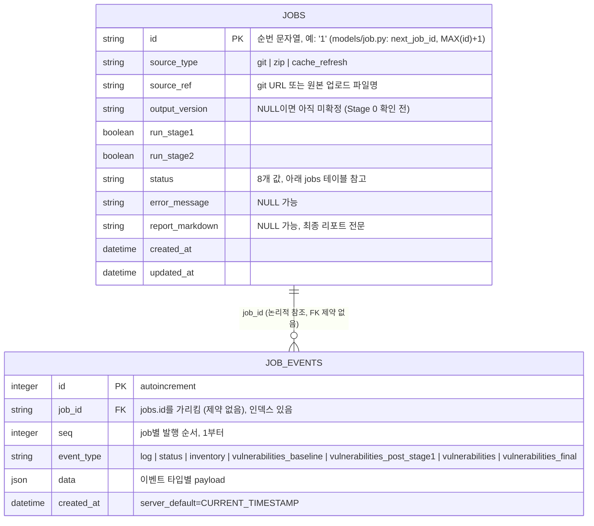

# SQLite 데이터베이스 (`backend/data/app.db`)

- 작성일: 2026-08-07 (2026-08-11 개정: Stage 0 상태값/이벤트 타입, job 삭제, `next_job_id` 채번 방식 변경 반영)
- 대상: `backend/app/models/db.py`, `backend/app/models/job.py`에 정의된 실제 스키마. `backend/data/app.db`(기본 `DATABASE_URL=sqlite:///./data/app.db`, [`backend/.env.example`](../backend/.env.example))의 실제 테이블 정의(`sqlite_master`)와 실제 데이터(2026-08-11 기준 job 17건, job_events 673건)를 대조해 일치를 확인했다.
- 아키텍처 전반 맥락은 [`docs/architecture.md`](architecture.md) §10 "Job 상태/진행 스트리밍"을 함께 참고.

## 개요

- 엔진: SQLite. `Settings.database_url_resolved`가 상대 경로를 `backend/` 기준으로 resolve한다 (`app/config.py`) — 그래서 기본값이 `backend/data/app.db`가 된다.
- 마이그레이션 프레임워크 없음: `models/db.py`의 `init_db()`가 앱 기동 시 `Base.metadata.create_all(engine)`로 "없으면 생성"만 한다(ddl-auto 방식). 스키마 변경 시 별도 마이그레이션 스크립트가 없으므로, 컬럼을 추가/변경하면 기존 `app.db` 파일과 어긋날 수 있다.
- 테이블은 **`jobs`, `job_events` 단 2개**뿐이다. 이 도구가 다루는 실제 산출물(diff, report, effective-pom.xml, 서브프로세스/LLM 로그 등)은 DB가 아니라 파일시스템(`JOBS_DATA_DIR/<job_id>/output/...`)에 저장된다 — DB는 오직 **job의 메타데이터와 진행 이벤트 타임라인**만 담당한다.
- `job_events.job_id`는 `jobs.id`를 논리적으로 참조하지만, SQLAlchemy 모델에 `ForeignKey`가 선언되어 있지 않다 — **DB 레벨 참조 무결성 제약은 없다** (아래 "관계" 참고).

## ERD



## 테이블: `jobs`

한 번의 인입→Stage 0(버전 확인)→1단계→2단계→산출물 생성 실행 전체를 나타내는 행. `POST /jobs`가 한 행을 만들고, 백그라운드로 도는 `orchestration/pipeline.run_pipeline`(인입+Stage 0까지)과 사람의 확인 후 이어받는 `run_pipeline_resume_after_version_confirm`(그 이후)이 같은 행을 계속 갱신한다([`architecture.md`](architecture.md) §4).

| 컬럼 | 타입 | Null | 기본값 | 설명 |
|---|---|---|---|---|
| `id` | VARCHAR | NOT NULL (PK) | — | `models/job.py`의 `next_job_id(db)`가 발급하는 **로컬 순번 문자열**(`"1"`, `"2"`, ...). UUID가 아니라 사람이 읽기 쉽고, `JOBS_DATA_DIR/<id>/{source,work,output}/` 디렉토리명과 그대로 일치한다. 채번은 `MAX(CAST(id AS INTEGER)) + 1`(개수 세기가 아니다) — `DELETE /jobs/{id}`로 job이 삭제될 수 있게 되면서, 단순 개수 기반 채번은 삭제로 비어 있지 않은 자리와 충돌할 위험이 있어 바꿨다(코드 주석 참고). 삭제된 id는 재사용되지 않는다. `cast(Job.id, Integer)`는 SQLite 전용으로 검증됐다 — 다른 `DATABASE_URL` 방언 지원 계획 없음. |
| `source_type` | VARCHAR | NOT NULL | — | `"git"`, `"zip"`, 또는 `"cache_refresh"`(마이그레이션 job이 아니라 NVD/Trivy 캐시 갱신 유틸리티 실행, [`architecture.md`](architecture.md) §8.4 — `list_jobs`가 이 값은 걸러내므로 `history.html`에는 안 보임). |
| `source_ref` | VARCHAR | NOT NULL | — | `source_type="git"`이면 Git URL, `"zip"`이면 업로드 원본 파일명. `"cache_refresh"`에는 별 의미 없는 고정값이 들어간다(인자 없는 실행이므로). |
| `output_version` | VARCHAR | NULL 허용 | — | 확정된 출력 아티팩트 버전(`versions:set` 대상 값). 더 이상 job 생성 시 사용자가 직접 입력하는 값이 아니다 — Stage 0가 자동 계산해 제안하고, 사람이 `POST /jobs/{id}/confirm-version`으로 확인해야 이 컬럼이 채워진다([`architecture.md`](architecture.md) §4.1). 1·2단계 둘 다 미선택이면 Stage 0 자체를 안 타므로 계속 NULL로 남는다. |
| `run_stage1` | BOOLEAN | NOT NULL | `True` | 1단계(스택 마이그레이션) 실행 여부. |
| `run_stage2` | BOOLEAN | NOT NULL | `False` | 2단계(개별 CVE 패치, 옵션) 실행 여부. |
| `status` | VARCHAR | NOT NULL | `"queued"` | `JOB_STATUSES = ("queued", "running", "awaiting_version_approval", "awaiting_approval", "success", "needs_handoff", "failed", "cancelled")` 중 하나. DB 레벨 CHECK 제약이나 enum 타입은 쓰지 않는다 — SQLite에 네이티브 enum이 없고, 마이그레이션 없이 상태값을 늘릴 수 있게 하려는 의도적 선택(코드 주석 참고). `awaiting_version_approval`(Stage 0 완료, 출력 버전 확인 대기)과 `awaiting_approval`(1단계 인수인계 + 2단계 승인 대기)은 의도적으로 비종료 상태다. `TERMINAL_JOB_STATUSES = {"success", "needs_handoff", "failed", "cancelled"}`가 종료 상태 집합. |
| `error_message` | VARCHAR | NULL 허용 | — | `status="failed"`일 때 예외 메시지. |
| `report_markdown` | VARCHAR | NULL 허용 | — | 최종 리포트(`output/report.md`와 동일 내용)의 전문. 종료 상태에서만 채워짐. |
| `created_at` | DATETIME | NOT NULL | `datetime.now(UTC)` (Python 쪽 default) | 행 생성 시각. |
| `updated_at` | DATETIME | NOT NULL | `datetime.now(UTC)`, `onupdate`로 갱신 | 마지막 갱신 시각. |

**인덱스**: `sqlite_autoindex_jobs_1` (PK `id`에 대한 SQLite 자동 인덱스). 그 외 별도 인덱스 없음.

## 테이블: `job_events`

진행 상황 타임라인의 한 항목. `GET /jobs/{id}/events`(SSE)가 과거 이벤트를 이 테이블에서 재생한 뒤 실시간 이벤트로 전환한다 (`streaming/sse.py`). 저장은 `streaming/events.emit_event()`가 담당하며, 저장과 동시에(같은 함수 안에서) 인메모리 pub/sub(`streaming/bus.py`)로도 발행해 열려 있는 SSE 연결에 즉시 흘려보낸다.

| 컬럼 | 타입 | Null | 기본값 | 설명 |
|---|---|---|---|---|
| `id` | INTEGER | NOT NULL (PK, autoincrement) | — | 테이블 전역 자동증가 PK. `seq`와 달리 job을 넘나드는 값이라 클라이언트에는 노출되지 않는다. |
| `job_id` | VARCHAR | NOT NULL | — | `jobs.id`를 가리키는 논리적 참조. **인덱스(`ix_job_events_job_id`) 있음**, FK 제약은 없음. |
| `seq` | INTEGER | NOT NULL | — | 같은 `job_id` 안에서 1부터 증가하는 순번 (`streaming/events._next_seq`가 `MAX(seq)+1`로 채번). SSE의 이벤트 재생 순서 보장 및 재연결 시 중복 전달 방지에 쓰인다. |
| `event_type` | VARCHAR | NOT NULL | — | 실제로 쓰이는 값: `"log"`, `"status"`, `"inventory"`(Stage 0의 감지된 스택), `"vulnerabilities_baseline"`(마이그레이션 전 스캔), `"vulnerabilities_post_stage1"`(1단계 이후 재스캔), `"vulnerabilities"`(2단계 패치 대상), `"vulnerabilities_final"`(2단계 이후 최종 스캔) — 취약점/스택 스냅샷들도 전부 이 테이블에 영속화된다([`architecture.md`](architecture.md) §4.1/§7.5/§8.1/§8.3). 코드 주석은 `"llm"`도 언급하지만 실제로 발행되는 곳은 없다 — LLM 호출 로그는 이 테이블이 아니라 `output/logs/<stage>/llm/*.json` 파일로 별도 저장됨(§7.2). SSE에는 `job_id`를 찾을 수 없을 때만 나오는 `"error"` 타입도 있지만, 이건 DB에 저장되지 않는 스트림 전용 합성 이벤트다. |
| `data` | JSON | NOT NULL | — | `event_type`별 payload. `"log"` → `{"message": "..."}`. `"status"` → `{"status": "..."}` — 실패 시 `error` 키, `awaiting_version_approval` 시 `current_version`/`suggested_version` 키가 추가됨. `"inventory"` → 감지된 스택 필드(java/spring 버전 등). `"vulnerabilities*"` 4종 → `{"vulnerabilities": [...]}`. |
| `created_at` | DATETIME | NOT NULL | `CURRENT_TIMESTAMP` (SQLite 서버 기본값) | 행 생성 시각. `jobs`와 달리 Python 쪽이 아니라 **DB 서버 기본값**을 쓴다(`server_default=func.now()`). |

**인덱스**: `sqlite_autoindex_job_events_1`(PK `id`), `ix_job_events_job_id`(컬럼 `job_id`) — `WHERE job_id = ?` 조회(재생, 카운트)를 위한 것.

## 관계

```
jobs (1) ──< job_events (N)
```

- 하나의 `jobs` 행은 여러 `job_events` 행을 갖는다(진행되면서 계속 `emit()`됨). 2026-08-11 기준 실제 운영 데이터로는 job 17건에 이벤트 673건 — job당 이벤트 수는 스캔이 몇 번 도는지(Stage 0/1/2 여부)와 AI 수정 재시도 횟수에 따라 편차가 크다(참고용 스냅샷일 뿐 고정값 아님).
- **SQLAlchemy 모델에 `ForeignKey("jobs.id")`가 선언되어 있지 않다** — 즉 SQLite가 참조 무결성을 강제하지 않는다(`job_events.job_id`에 존재하지 않는 `jobs.id` 값이 들어가도 에러가 나지 않는다). 애플리케이션 코드가 항상 `job_id`를 job 생성 직후에만 이벤트 발행에 사용하므로 실무상 깨질 일은 없지만, DB 자체가 이를 보장하지는 않는다는 점은 스키마를 바꿀 때 유의할 부분이다.
- **두 테이블 모두 append-only가 아니다.** `DELETE /jobs/{id}`(터미널 상태인 job만 대상, `api/routers/jobs.py`)는 FK 제약이 없어 DB 레벨 cascade에 기댈 수 없으므로, 애플리케이션 코드가 직접 `job_events`에서 `job_id`가 일치하는 행을 먼저 지우고 나서 `jobs` 행을 지운다(순서를 반대로 하면 참조가 끊긴 `job_events` 행이 고아로 남음). 삭제된 `id`는 `next_job_id`가 재사용하지 않는다(`jobs` 테이블 `id` 컬럼 설명 참고) — 그래서 실제 job id 목록에 군데군데 빈 구간이 생긴다.

## 참고

- `backend/app/models/db.py` — 엔진/세션 생성, `init_db()`(create-if-missing), 경로 resolve 로직.
- `backend/app/models/job.py` — `Job`/`JobEvent` 모델, 상태값 상수, `next_job_id()`.
- `backend/app/streaming/events.py` / `backend/app/streaming/sse.py` — `job_events` 쓰기/재생 로직.
- [`docs/architecture.md`](architecture.md) — 전체 아키텍처, 이 DB가 파이프라인/SSE와 어떻게 맞물리는지.
