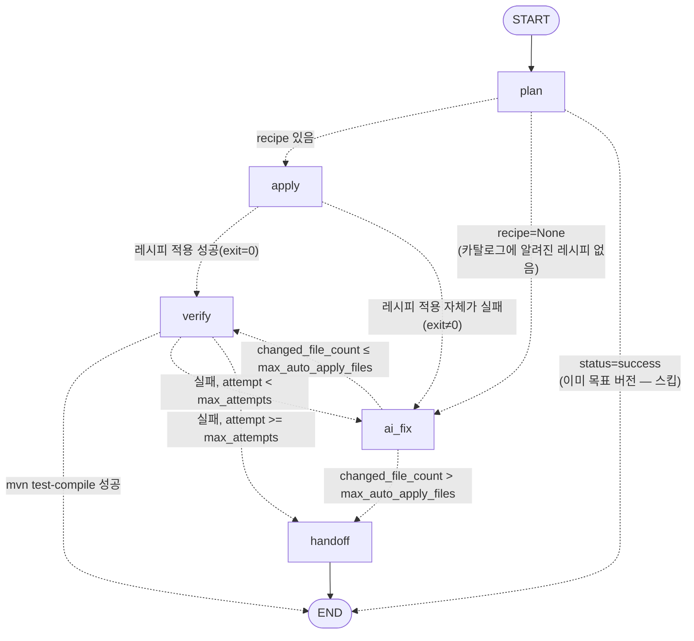
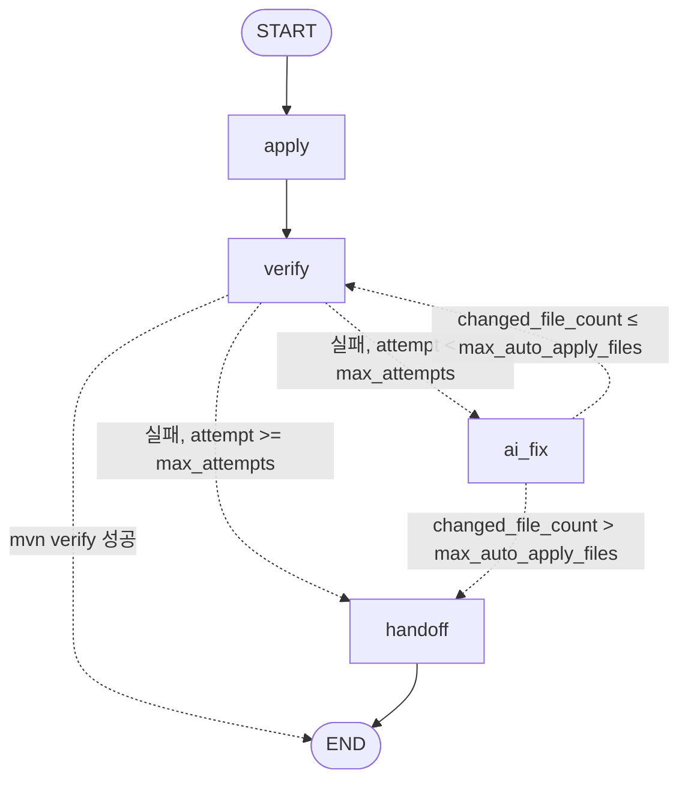
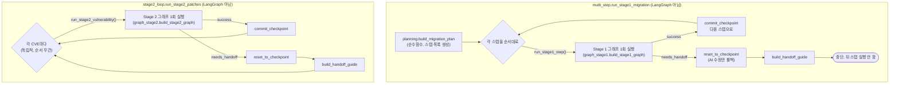

# LangGraph 오케스트레이션 — Stage 1 / Stage 2 자가검증 루프

- 작성일: 2026-08-08 (2026-08-11 개정: Stage 0 도입으로 바뀐 외부 루프 호출자 반영)
- 이 문서는 `backend/app/orchestration/` 중 실제로 **LangGraph `StateGraph`로 구현된 부분만** 그래프 단위로 상세히 정리한다. 전체 파이프라인(인입 → Stage 0 → Stage1 → Stage2 → 산출물) 흐름은 [`docs/architecture.md`](architecture.md) §4·§4.1·§7·§8을 참고하고, 이 문서는 그중 "LangGraph가 실제로 어디에 있고 각 노드가 뭘 하는지"에만 집중한다.

## 1. 어디에 LangGraph가 있는가

이 도구에는 LangGraph `StateGraph`가 **정확히 두 개** 있다. 둘 다 "**한 개의 작은 작업 단위**(마이그레이션 스텝 1개 / CVE 1개)를 자가검증(빌드 성공까지 재시도)하는 루프"이고, 모양이 거의 동일하다.

| 그래프 | 빌더 함수 | State 타입 | 처리 단위 | 그래프 밖 반복자 |
|---|---|---|---|---|
| Stage 1 그래프 | [`graph_stage1.build_stage1_graph`](../backend/app/orchestration/graph_stage1.py) | [`Stage1State`](../backend/app/orchestration/state.py) | 마이그레이션 계획의 스텝 1개 (예: "Spring Boot 3.4→3.5") | [`multi_step.run_stage1_migration`](../backend/app/orchestration/multi_step.py) — 계획의 스텝들을 순서대로, 실패 시 즉시 중단 |
| Stage 2 그래프 | [`graph_stage2.build_stage2_graph`](../backend/app/orchestration/graph_stage2.py) | [`Stage2State`](../backend/app/orchestration/state2.py) | CVE 1건 | [`stage2_loop.run_stage2_patches`](../backend/app/orchestration/stage2_loop.py) — CVE 목록을 전부 시도, 실패해도 계속 진행 |

**중요한 구분**: "체크포인트/롤백"이라는 단어가 스펙과 코드 전반에 나오지만, 이건 **LangGraph의 checkpointer 기능이 아니다**. 이 두 그래프는 `graph.compile()`을 checkpointer 없이 호출하고(`persistence` 없음), 매 스텝/매 CVE마다 `graph.ainvoke(state)`를 **새로** 호출한다 — 그래프 실행 자체는 상태를 디스크에 남기지 않는다. 실제 체크포인트/롤백은 `work/` 디렉토리를 [`checkpoint/git_repo.py`](../backend/app/checkpoint/git_repo.py)로 관리하는 **git 커밋**이며, 이건 그래프 밖(외부 반복자, `apply_node`, `route_after_*`)에서 명시적으로 호출된다. 두 개념을 혼동하지 않도록 이 문서에서는 "그래프 노드"와 "git 체크포인트"를 항상 구분해서 표기한다.

## 2. 두 그래프가 공유하는 부품

| 부품 | 파일 | 역할 |
|---|---|---|
| `get_chat_model` | [`llm.py`](../backend/app/orchestration/llm.py) | `ChatOpenAI` 인스턴스를 만드는 lazy 팩토리(`OPENAI_API_KEY` 없으면 노드 실행 시점에 에러 — import 시점이 아님, LLM을 쓰지 않는 단위테스트가 키 없이도 돌게 하기 위함). |
| `build_tools` | [`tools.py`](../backend/app/orchestration/tools.py) | `ai_fix` 노드의 에이전트에게 주는 5개 도구: `read_file`, `edit_file`(전체 파일 내용 덮어쓰기), `run_build`(`mvn test-compile` — 운영+테스트 소스 컴파일, 테스트 실행은 안 함), `run_recipe`(OpenRewrite 레시피 1개 직접 실행), `list_available_recipes`. 모든 파일 접근은 `work_dir` 밖으로 못 나가게 경로 검증(`_safe_path`)됨. |
| `LocalLLMLogger` | [`callbacks.py`](../backend/app/orchestration/callbacks.py) | `ai_fix` 노드가 `agent.ainvoke`를 호출할 때마다 콜백으로 주입. LLM 호출 1건당 `output/logs/{stage}/llm/*.md` 1개를 남김(system prompt, 대화 이력, 툴 호출, 응답, 토큰 사용량). 그래프 노드가 실행될 때마다(=재시도마다) **새 인스턴스**가 만들어지므로 파일명의 타임스탬프로 전체 순서를 복원한다. |
| `create_agent` | `langchain.agents` (외부) | `ai_fix` 노드 안에서 모델+도구+시스템 프롬프트로 임시 ReAct형 에이전트를 조립. 그래프 노드 자체는 아니고, 노드 내부에서 한 번 쓰고 버려지는 하위 실행기. |

## 3. Stage 1 그래프 — 스택 마이그레이션 스텝 1개

### 3.1 State (`Stage1State`)

| 필드 | 타입 | 의미 |
|---|---|---|
| `job_id`, `work_dir` | `str` | 대상 job과 작업 디렉토리 |
| `detected_spring_boot` | `str \| None` | 감지된 현재 Spring Boot 버전 |
| `target_spring_boot` | `str` | 이 스텝이 도달해야 할 목표 버전 |
| `recipe`, `artifact` | `str \| None` | 적용할 OpenRewrite 레시피 클래스 / 그 레시피가 속한 Maven 좌표. 카탈로그에 없으면 둘 다 `None` |
| `plan_precomputed` | `bool` | 외부 계획 수립기(`planning.build_migration_plan`)가 이미 `recipe`/`artifact`를 정해서 넘겼는지 — `True`면 `plan` 노드가 자체 계산을 건너뜀 |
| `attempt`, `max_attempts` | `int` | AI 수정 재시도 카운터/상한(`COMPILE_FIX_MAX_ATTEMPTS`) |
| `max_auto_apply_files` | `int` | 자동 적용 파일 수 상한(`COMPILE_FIX_AUTO_APPLY_MAX_FILES`, 레시피 없는 스텝은 `_NO_RECIPE`로 더 관대함) |
| `apply_returncode` | `int \| None` | 방금 `apply` 노드가 돌린 레시피의 종료 코드. `recipe=None`이라 `apply` 자체를 안 거친 스텝은 계속 `None`. `route_after_apply`(§3.4)가 이 값으로 `verify`를 건너뛸지 정함 |
| `last_build_output` | `str` | 가장 최근 빌드/레시피 실행 결과 (다음 AI 수정 프롬프트에 그대로 삽입됨) |
| `status` | `"running" \| "success" \| "failed" \| "needs_handoff"` | 그래프 종료 시 외부 반복자가 보는 최종 결과 |
| `messages` | `Annotated[list, add_messages]` | `ai_fix`가 매 시도마다 반환하는 에이전트 대화(시스템/사람/AI/도구 메시지)가 **누적**됨(reducer `add_messages`) — 실패 시 handoff 가이드가 이 전체 이력을 사용 |

### 3.2 그래프 구조

실선은 `graph.add_edge`(조건 없는 고정 엣지), 점선은 `graph.add_conditional_edges`(라우팅 함수가 상태를 보고 고르는 분기)다.

### 3.3 노드별 설명

| 노드 | 함수 | 하는 일 | 부수효과 |
|---|---|---|---|
| **plan** | `plan_node` | `plan_precomputed=True`면 그대로 통과. 아니면 `RecipeCatalog`에서 감지 버전→목표 버전으로 가는 다음 홉을 조회(`plan_next_step`, 순수함수 — I/O 없음). 이미 목표 버전이면 `status="success"`. 카탈로그에 다음 홉이 없으면 `recipe=None`으로 두고 파일 수 상한을 `_NO_RECIPE` 값으로 바꿔서 반환 | 없음 (순수 계산) |
| **apply** | `apply_node` | `run_openrewrite_recipes`로 `mvnrewrite/rewrite_client`를 통해 `org.openrewrite.maven:rewrite-maven-plugin:RELEASE`를 직접 좌표 호출(대상 프로젝트 `pom.xml`에 플러그인을 주입하지 않음). 종료 코드를 `apply_returncode`에 기록 | 실행 로그를 `output/logs/stage1/openrewrite-*.log`에 기록. **레시피 적용 직후, verify 결과와 무관하게 `commit_checkpoint`로 git 커밋** — 이후 `ai_fix`가 실패해도 이 레시피의 기계적 변경은 살아남음(§3.4) |
| **verify** | `verify_node` | `mvn test-compile`(운영+테스트 소스 컴파일, 테스트 실행은 안 함) 실행. 성공하면 `status="success"` | 로그를 `output/logs/stage1/mvn-test-compile-*.log`에 기록 |
| **ai_fix** | `ai_fix_node` | `create_agent`로 `read_file`/`edit_file`/`run_build`/`run_recipe`/`list_available_recipes` 도구를 쓰는 에이전트를 즉석 조립해 호출. 두 가지 경우: (1) 레시피 적용 후 컴파일 실패 → 빌드 에러를 고쳐달라는 프롬프트, (2) 레시피 자체가 없음(`attempt==0`) → 목표 버전까지 직접 올려달라는 프롬프트, 이후 재시도부터는 "아직도 컴파일 안 된다"는 빌드 출력을 계속 붙여서 재요청 | `attempt`를 1 증가, 에이전트가 만든 메시지들을 `messages`에 누적. **git 커밋은 하지 않음** — 성공 여부가 아직 미확인이므로 `verify`가 다시 확인한 뒤에야 그 결과가 다음 스텝/handoff로 이어짐 |
| **handoff** | `handoff_node` | `status="needs_handoff"`로 표시만 함 | 없음 — 실제 롤백/가이드 생성은 그래프 밖, `multi_step.run_stage1_migration`이 함(§3.4) |

### 3.4 라우팅 함수 (조건부 엣지)

- `route_after_plan`: `status=="success"` → `END`(이미 목표), `recipe is None` → `ai_fix`(레시피 없이 AI가 직접), 그 외 → `apply`.
- `route_after_apply`(2026-08-09 추가): `apply_returncode == 0` → `verify`, 아니면(레시피 실행 자체가 실패) → `verify`를 건너뛰고 곧장 `ai_fix`. `verify`로 보내면 아무 변경도 없이 우연히 컴파일이 통과해 조용히 "성공"으로 끝나거나, 원래 실패 원인이 `verify`의 결과로 덮어써져 사라질 수 있어서 — 자세한 배경은 `docs/superpowers/specs/2026-08-09-stage1-apply-verify-integrity-design.md` 참고.
- `route_after_verify`: 성공 → `END`, `attempt >= max_attempts` → `handoff`, 그 외 → `ai_fix`.
- `route_after_ai_fix`: `changed_file_count(work_dir)`(git으로 마지막 체크포인트 이후 변경된 파일 수)가 `max_auto_apply_files`를 넘으면 "블라스트 반경 게이트"로 `handoff`, 아니면 `verify`로 돌아가 다시 검증.

이 그래프 자체는 실패해도 아무것도 롤백하지 않는다 — `handoff`로 끝나면 상태만 `needs_handoff`가 되고, 그래프를 호출한 `multi_step.run_stage1_migration`이 `reset_to_checkpoint(work_dir, settings, current_head(...))`로 **AI 수정 시도만** 되돌린다(레시피 자체는 `apply` 노드에서 이미 커밋됐으므로 살아남음).

## 4. Stage 2 그래프 — CVE 패치 1건

Stage 1과 거의 같은 모양이지만 **계획 수립(`plan`) 단계가 없다** — CVE 하나는 그 자체로 이미 "무엇을 해야 하는지"(`fix_version`)가 스캐너 결과로 정해져 있으므로.

### 4.1 State (`Stage2State`)

| 필드 | 타입 | 의미 |
|---|---|---|
| `job_id`, `work_dir` | `str` | Stage 1과 동일 |
| `cve_id` | `str` | 대상 CVE ID |
| `package` | `str` | `groupId:artifactId` |
| `installed_version` | `str` | 현재 설치된(취약한) 버전 |
| `fix_version` | `str \| None` | 스캐너가 보고한 안전 버전. `None`이면 기계적으로 시도할 게 없어 AI가 직접 찾아야 함 |
| `attempt`, `max_attempts`, `max_auto_apply_files` | `int` | Stage 1과 동일한 재시도/블라스트 반경 게이트 |
| `last_build_output` | `str` | Stage 1과 동일 |
| `status` | `"running" \| "success" \| "needs_handoff"` | Stage 1과 달리 `"failed"`가 없음 — 실패는 항상 `needs_handoff`로 수렴 |
| `messages` | `Annotated[list, add_messages]` | Stage 1과 동일 |

### 4.2 그래프 구조

실선은 `graph.add_edge`(조건 없는 고정 엣지), 점선은 `graph.add_conditional_edges`(라우팅 함수가 상태를 보고 고르는 분기)다.

### 4.3 노드별 설명

| 노드 | 함수 | 하는 일 | 부수효과 |
|---|---|---|---|
| **apply** | `apply_node` | `fix_version`이 없으면 아무것도 하지 않고 통과(다음 `verify`가 실패할 것을 알면서도 그대로 진행 → `ai_fix`로 넘어가는 정상 경로). 있으면 `dependency_patch.patch_dependency_version`으로 `pom.xml`의 의존성 버전을 올림(의존성이 `${property}`로 선언돼 있으면 `versions:set-property`, 리터럴이면 `versions:use-dep-version` — Maven Versions Plugin의 `use-dep-version`이 property 참조 의존성은 조용히 건너뛴다는 걸 실측 확인하고 분기) | 로그를 `output/logs/stage2/dependency-patch-{cve_id}.log`에 기록. **이 노드는 git 커밋을 하지 않는다** — Stage 1의 `apply`와 달리, 여기선 `verify` 통과까지 확인된 뒤 외부 반복자(`stage2_loop.py`)가 커밋함(§4.4) |
| **verify** | `verify_node` | `mvn verify`(컴파일+테스트). 스펙의 "Dependency-Check/Trivy 재실행"은 CVE 1건마다 돌리기엔 너무 느려서, 배치 전체 실행 전/후 스캔으로 대체(§4.4 밖, `pipeline.py` 레벨) | 로그를 `output/logs/stage2/mvn-verify-{cve_id}.log`에 기록 |
| **ai_fix** | `ai_fix_node` | Stage 1과 같은 도구 세트로 에이전트 조립. 프롬프트는 "CVE {id}를 패키지 {package}에서 해결하라, 현재 버전 {installed_version}, (있다면) 제안 수정 버전 {fix_version}, 지금까지의 빌드/검증 출력"을 담아 매 시도 동일한 형태로 재구성(Stage 1처럼 첫 시도/재시도 프롬프트가 갈리지 않음 — CVE는 항상 "무엇을 고쳐야 하는지"가 이미 명확하므로) | Stage 1과 동일 |
| **handoff** | `handoff_node` | `status="needs_handoff"`로 표시만 함 | 없음 |

### 4.4 라우팅 함수 및 Stage 1과의 차이

- `route_after_verify` / `route_after_ai_fix`: Stage 1과 로직 동일(재시도 상한, 파일 수 상한).
- **`plan` 노드가 없다**: `START`가 바로 `apply`로 연결되는 고정 엣지 — CVE 처리는 "계획"이 필요 없는 단발 작업이기 때문.
- **`apply`가 git 커밋을 하지 않는다**: Stage 1은 레시피의 "기계적 변경"과 "AI 수정"을 구분해 레시피 쪽만 먼저 커밋해 보호하지만, Stage 2의 버전 패치 자체는 그 정도로 분리해 보호할 이유가 없다고 보고 성공(`verify` 통과) 후 외부 루프(`stage2_loop.run_stage2_patches`)가 한 번에 커밋한다.
- **실패해도 다음 CVE로 계속 진행**: Stage 1의 외부 루프(`multi_step.py`)는 스텝이 서로 의존적이라 실패 시 그 자리에서 멈추지만, Stage 2의 외부 루프(`stage2_loop.py`)는 CVE들이 서로 독립적이므로 하나가 `needs_handoff`여도 나머지를 계속 시도한다(코드 주석 원문: "deliberately no `break` here -- CVE patches are independent").

## 5. Stage 1 vs Stage 2 요약 비교

| 항목 | Stage 1 그래프 | Stage 2 그래프 |
|---|---|---|
| 처리 단위 | 마이그레이션 계획의 스텝 1개 | CVE 1건 |
| 계획 단계(`plan` 노드) | 있음 | 없음 (`START`→`apply` 고정) |
| `apply` 실행 내용 | OpenRewrite 레시피 | Maven Versions Plugin (`set-property` / `use-dep-version`) |
| `apply`에서 git 커밋 여부 | **함** (레시피 변경을 즉시 보호) | 안 함 (성공 확정 후 외부 루프가 커밋) |
| `verify` 명령 | `mvn compile` | `mvn verify` (컴파일+테스트) |
| 종료 상태 | `success` / `failed`(계획 자체가 없을 때) / `needs_handoff` | `success` / `needs_handoff` |
| 외부 반복자가 실패 시 | **중단** (뒤 스텝은 앞 스텝 성공을 전제) | **계속 진행** (CVE는 서로 독립) |

## 6. 그래프를 감싸는 외부 반복자 (LangGraph 아님, 순수 파이썬 루프)

두 그래프 모두 "한 단위"만 처리하므로, 실제로 여러 스텝/여러 CVE를 순회하는 건 그래프 밖의 평범한 `for` 루프다. 이 루프들은 `graph.ainvoke()`를 반복 호출하고, 그 결과(`status`, `messages`, `last_build_output`)를 보고 git 체크포인트/롤백과 handoff 가이드 생성을 스스로 처리한다.

- **`run_stage1_step`/`run_stage1_single_step`** (`graph_stage1.py`)와 **`run_stage2_vulnerability`** (`graph_stage2.py`)는 매번 `build_stage1_graph`/`build_stage2_graph`로 그래프를 **새로 컴파일**하고 `ainvoke`로 한 번 실행한 뒤 버린다 — 그래프 인스턴스를 여러 스텝/CVE에 걸쳐 재사용하지 않는다(무거운 컴파일 비용은 없고, `on_log` 클로저가 매번 다시 바인딩되어야 하기 때문).
- `run_pipeline`은 인입과 Stage 0(버전 확인 게이트, [`architecture.md`](architecture.md) §4.1)까지만 하고 멈춘다 — Stage 1/2 외부 루프는 둘 다 호출하지 않는다. 실제로는 사람이 출력 버전을 확인한 뒤 이어지는 `run_pipeline_resume_after_version_confirm`이 `multi_step.run_stage1_migration`(Stage 1)과 `_run_stage2_block`(Stage 2)을 호출한다. `_run_stage2_block`은 `run_pipeline_resume_after_version_confirm`과 HITL 재개 경로 `run_pipeline_resume_stage2` 양쪽에서 공유된다. 전체 파이프라인 그림은 [`docs/architecture.md`](architecture.md) §4·§4.1을 참고.

## 7. 참고

- 전체 아키텍처: [`docs/architecture.md`](architecture.md)
- 계획 수립 로직(Stage 1 그래프의 `plan` 노드가 스킵할 때 대신 쓰는 외부 계획기): [`orchestration/planning.py`](../backend/app/orchestration/planning.py)
- 레시피 카탈로그(스텝별 OpenRewrite 레시피 매핑, confidence 표기): [`mvnrewrite/recipe_catalog.yaml`](../backend/app/mvnrewrite/recipe_catalog.yaml)
- 체크포인트/롤백 git 구현: [`checkpoint/git_repo.py`](../backend/app/checkpoint/git_repo.py)
