# 파이프라인 흐름 (`orchestration/pipeline.py`)

- 작성일: 2026-08-12
- 이 문서는 [`pipeline.py`](../backend/app/orchestration/pipeline.py)의 최상위 오케스트레이션 함수 4개(`run_pipeline`, `run_pipeline_resume_after_version_confirm`, `run_pipeline_resume_stage2`, `run_pipeline_resume_stage1_after_handoff`)가 서로 어떻게 이어지는지, 그리고 각 함수 내부가 어떤 순서로 갈라지는지를 그래프로 정리한다.
- Job `status` 값 자체의 전이표는 [`architecture.md`](architecture.md) §7.4의 상태 다이어그램을, Stage 1/2 내부 LangGraph 자가검증 루프는 [`langgraph-orchestration.md`](langgraph-orchestration.md)를 참고 — 이 문서는 그 중간층, "pipeline.py의 각 함수가 내부적으로 뭘 어떤 순서로 하는지"에 집중한다.

## 전체 흐름

실선은 항상 일어나는 전이, 점선은 조건부 분기다. stadium 모양(`(["..."])`)은 함수가 리턴하며 살아있는 Task 없이 사람의 다음 액션(HITL)을 기다리는 지점이거나 최종 Job 상태다.

```mermaid
flowchart TD
    START(["작업시작<br/>(POST /jobs)"]) --> ING1

    subgraph RP["run_pipeline"]
        subgraph INGEST["check"]
            ING1["작업 디렉토리 생성<br/>(source/, work/, output/)"]
            ING1 --> ING11
            ING11{"입력유형"}
            ING11 -.->|"Git"| ING2A["git clone --depth 1<br/>(source/)"]
            ING11 -.->|"ZIP"| ING2B["zip 추출"]
            ING2B --> ING2C["단일 최상위 폴더 벗기기<br/>(source/)"]
            ING2A --> ING3{"Maven?"}
            ING2C --> ING3
            ING3 -.->|"감지됨"| ING41["소스복사<br/>(work/)"]
            ING42[" checkpoint 커밋<br/>(baseline/)"]
            ING5{"단계 선택"}
            ING41 --> ING42
            ING42 --> ING5
        end
        ING3 -.->|"Maven 아님"| RP_FAIL(["END<br/>failed"])
        ING5 -.->|"1·2단계 둘 다 미선택"| RP_DONE(["END<br/>success"])
        ING5 -.->|"하나 이상 선택"| S0_1

        subgraph STAGE0["Stage 0 (source/)"]
            S0_1["스택 분석<br/>(mvn help:effective-pom)"] --> S0_DC["dependency-check 스캔<br/>(mvn install)"]
            S0_1 --> S0_TRIVY["Trivy 스캔<br/>(trivy fs)"]
            S0_DC -->|"OWASP"| S0_MERGE["스캔 결과 병합/취합"]
            S0_TRIVY -->|"Trivy"| S0_MERGE
            S0_MERGE --> S0_2{"parent?"}
            S0_2 -.->|사내 parent POM| S0_2A["사내 버전 추출"]
            S0_2 -.->|PUBLIC parent POM| S0_2B{"기술스택"}
            S0_2B -.->|"기술스택 업 필요"| S0_2B_1["major version 계산"]
            S0_2B -.->|"이미 목표스택임."| S0_2B_2["minor version 계산"]
            S0_3["출력 버전 제안"]
            S0_2A --> S0_2B
            S0_2B_1 --> S0_3
            S0_2B_2 --> S0_3
        end

        S0_3 --> RP_WAIT(["END<br/>awaiting_version_approval"])
    end
    START2(["HITL<br/>(POST .../confirm-version)"])
    RP_WAIT -.-> START2
    START2 -->|"확정"| RC_VERSION

    subgraph RC["run_pipeline_resume_after_version_confirm"]
        RC_REUSE["2단계 대상 = Stage 0 베이스라인 스캔 재사용"]
        RC_STAGE1{"Stage 1?"}
        RC_VERSION["출력 버전 적용<br/>(mvn versions:set)"]
        RC_VERSION --> RC_GIT_1["checkpoint 커밋<br/>(version 기록)"]
        RC_GIT_1 --> RC_VERSION_1{"parent?"}
        RC_VERSION_1 -.->|"사내 parent POM 사용시"| RC_VERSION_2["parent 수정"]
        RC_VERSION_1 -.->|"public or none"| RC_STAGE1

        RC_VERSION_2 --> RC_STAGE1

        subgraph STAGE1["Stage 1 (multi_step.run_stage1_migration)"]
            RC_S1_PLAN["마이그레이션 계획 수립<br>(OpenRewrite 목록)"]
            RC_S1_PLAN --> RC_S1_GATE
            RC_S1_GATE{"유무?"}
            RC_S1_GATE -.->|"목표 기술 스택 충족"| RC_S1_NOGAP["no_gap"]
            RC_S1_GATE -.->|"있음"| RC_S1_LOOP
            RC_S1_LOOP{"다음?"}
            RC_S1_LOOP -.->|"다음 스텝"| RC_S1_STEP["Stage 1 LangGraph 1회 실행<br/>(plan→apply→verify→ai_fix→handoff)"]
            RC_S1_STEP -.->|"success"| RC_S1_COMMIT["checkpoint 커밋<br/>(receipe 기록)"]
            RC_S1_COMMIT --> RC_S1_LOOP
            RC_S1_STEP -.->|"needs_handoff"| RC_S1_RESET["reset_to_checkpoint<br/>(AI 수정 시도만 롤백,<br/>레시피 커밋은 유지)"]
            RC_S1_RESET --> RC_S1_GUIDE["build_handoff_guide"]
            RC_S1_GUIDE --> RC_S1_STOP["중단<br/>(뒤 스텝 실행 안 함)"]
        end

        RC_STAGE1 -.->|"Stage 1 포함"| RC_S1_PLAN
        RC_STAGE1 -.->|"Stage 1 미포함"| RC_REUSE

        RC_S1_LOOP -.->|"모든 스텝 통과"| RC_RESCAN["1단계 이후 재스캔 vulnerabilities_post_stage1"]
        RC_S1_NOGAP --> RC_RESCAN
        RC_S1_STOP --> RC_RESCAN
        RC_RESCAN -.->|"1단계 handoff + 2단계 요청됨"| RC_APPROVAL(["awaiting_approval Task 종료, 여기서 리턴"])
        RC_RESCAN -.->|"그 외"| RC_S2GATE["2단계 게이트"]
        RC_REUSE --> RC_S2GATE
        RC_S2GATE -.->|"2단계 선택"| RC_S2["2단계 실행 CVE별 그래프, 독립적(실패해도 계속)"]
        RC_S2GATE -.->|"2단계 미선택"| RC_FINAL["결과물 생성 diff/report"]
        RC_S2 --> RC_FINAL
        RC_FINAL --> RC_DONE(["success / stage1_needs_handoff / stage2_needs_handoff / failed"])
    end

    RC_APPROVAL -->|"POST .../proceed"| RS2_REUSE

    subgraph RS2["run_pipeline_resume_stage2"]
        RS2_REUSE["2단계 대상 = post_stage1 재스캔 재사용 (work/ 그 사이 안 바뀜)"] --> RS2_RUN["2단계 실행"]
        RS2_RUN --> RS2_FINAL["결과물 생성 1차 리포트 뒤에 이어붙임"]
        RS2_FINAL --> RS2_DONE(["stage2_needs_handoff / stage1_needs_handoff (1단계 갭은 여전)"])
    end

    RC_DONE -.->|"stage1_needs_handoff"| HUMAN(["사람이 work/를 직접 수정"])
    RS2_DONE -.->|"stage1_needs_handoff"| HUMAN
    HUMAN -->|"POST .../resume-stage1"| RSH_VERIFY

    subgraph RSH["run_pipeline_resume_stage1_after_handoff"]
        RSH_VERIFY["검증만 mvn test-compile, AI 재시도 없음"]
        RSH_VERIFY -.->|"실패"| RSH_FAIL(["stage1_needs_handoff 가이드를 최신 빌드 출력으로 갱신"])
        RSH_VERIFY -.->|"성공"| RSH_COMMIT["체크포인트 커밋 → mvn effective-pom 재분석"]
        RSH_COMMIT --> RSH_CONTINUE["run_stage1_migration 나머지 계획을 이어서 실행"]
        RSH_CONTINUE --> RSH_DONE(["success / stage1_needs_handoff"])
    end
```

## 각 함수가 왜 거기서 멈추는가

| 함수 | 멈추는 지점 | 사람의 다음 액션 | 비고 |
|---|---|---|---|
| `run_pipeline` | `awaiting_version_approval` | `POST /jobs/{id}/confirm-version` | Stage 0가 자동 제안한 출력 버전(그리고 사내 parent POM이 감지됐다면 그 목표 버전)을 사람이 확인해야 실제 코드 변경이 시작된다. §4.1, §4.2 |
| `run_pipeline_resume_after_version_confirm` | `awaiting_approval` (1단계가 막혔고 2단계도 요청된 경우만) | `POST /jobs/{id}/proceed` | 1단계의 미해결 갭은 2단계가 그 위에서 돈다고 사라지지 않으므로, 계속 진행할지 사람이 명시적으로 판단하게 한다. §7.4 |
| `run_pipeline_resume_stage2` | 항상 끝까지 실행 후 종료 | (막혔다면) `POST /jobs/{id}/resume-stage1` | `stage1_needs_handoff`로 되돌아가는 경우에도 이건 "재개 실패"가 아니라 "1단계 갭이 여전히 남아있다"는 원래 상태로의 복귀다. |
| `run_pipeline_resume_stage1_after_handoff` | `stage1_needs_handoff` (검증 실패 시) 또는 끝까지 실행 후 종료 | 검증 실패면 `work/`를 더 고친 뒤 같은 엔드포인트 재호출(반복 가능) | AI 재시도가 없다 — 사람이 방금 고친 걸 다시 AI가 건드리면 의도와 다르게 바뀔 수 있어서. §7.6 |

`IngestError`와 그 외 모든 예외는 4개 함수 전부 `except Exception`으로 잡아 `failed`로 마감한다(개별 job 실패가 서버 프로세스를 죽이지 않도록). `asyncio.CancelledError`는 별도로 `_finalize_cancelled`를 거쳐 `cancelled`로 마감된 뒤 재전파된다 — 다이어그램에는 지면상 생략했다.

## 참고

- 전체 아키텍처 및 각 단계 상세 서술: [`architecture.md`](architecture.md) §4, §4.1, §4.2, §7, §8
- Job `status` 값 자체의 상태 전이 다이어그램: [`architecture.md`](architecture.md) §7.4
- Stage 1/2 내부 LangGraph 자가검증 루프: [`langgraph-orchestration.md`](langgraph-orchestration.md)
