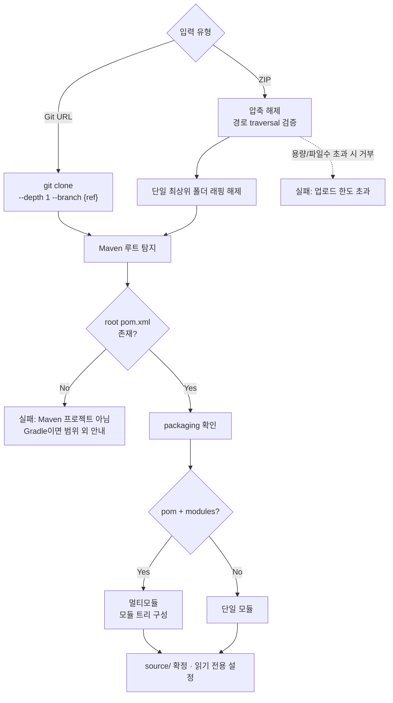

# 사내 Maven 시스템 스택 마이그레이션 / 취약점 해소 도구 설계

- 작성일: 2026-08-06
- 대상: 사내의 임의의 Maven(Java) 프로젝트. 각 프로젝트는 독립된 parent POM을 가지며, 현재 Java/Spring Boot/Spring Cloud/Spring AI 버전은 프로젝트마다 다르고 사전에 알 수 없다.
- 목표 스택: **Java 21 / Spring Boot 4.1 / Spring Cloud 2025.1 / Spring AI 2.0**

## 배경

오픈소스 취약점 해소가 이번 작업의 출발점이지만, 개별 CVE를 하나씩 패치하는 방식 대신 **사내 시스템을 정해진 목표 기술 스택(Java 21, Spring Boot 4.1, Spring Cloud 2025.1, Spring AI 2.0)으로 전면 업그레이드**하는 방식으로 접근한다. 오래된 Java/Spring 버전에 누적된 다수의 취약점은 개별 패치보다 스택 전체를 최신 LTS/메이저 버전으로 올리는 쪽이 근본적인 해결책이기 때문이다.

`ace-parent`, `ace-portal`, `anne-agent`, `daisy-agent` 4개 저장소는 이번에 만들 도구가 다룰 **소스(입력) 중 하나다**. 브레인스토밍 초반에는 이 저장소들의 구조(`-ai`/`-api`/`-web` 등)를 도구 자체가 따를 엔지니어링 컨벤션 참고 자료로 썼지만, 도구가 범용적으로 동작해야 하는 이상 이 저장소들 역시 실제로 도구에 넣어볼 수 있는 유효한 입력이다(예: 첫 테스트/데모 입력으로 활용 가능). 다만 이 4개가 도구의 유일한 대상은 아니다 — 다른 사내 시스템들은 이 저장소들과 무관하며 각자 독립된 parent POM을 갖고 있어, `ace-parent`처럼 한 곳만 고치면 전체가 따라오는 구조가 아니다. 따라서 도구는 **특정 저장소의 구조를 가정하지 않고 임의의 Maven 프로젝트에 범용적으로 동작**해야 한다.

**이 도구 자신의 구현 스택은 대상 시스템들과 별개다.** 대상 시스템은 Java/Maven이지만, 도구 자체는 **Python(FastAPI) + 별도 HTML 프론트엔드**로 만든다. OpenRewrite와 Maven 자체는 JVM 도구이므로 재구현하지 않고, Python 백엔드가 서브프로세스로 `mvn`을 호출하는 방식으로 연동한다.

## 범위

- **포함**: 임의의 Maven(Java) 프로젝트를 입력받아, 현재 버전을 스스로 감지하고 목표 스택(Java21/SpringBoot4.1/SpringCloud2025.1/SpringAI2.0)으로 업그레이드하는 범용 도구. 업그레이드 이후 남은 개별 OSS 취약점을 패치하는 옵션 단계.
- **제외**: Gradle 프로젝트(감지 시 범위 외 안내), npm/프론트엔드 의존성. 이번 스펙은 도구 자체의 설계이며, 특정 시스템에 대한 실제 마이그레이션 실행은 도구 구현 이후 별도로 진행한다(참고용 4개 저장소를 첫 테스트 입력으로 쓸 수 있음).
- **실행 환경**: 빌드 환경에서 NVD API(nvd.nist.gov) 등 외부 인터넷 접근 가능 전제. 사내망 프록시(`HTTP_PROXY`/`HTTPS_PROXY`/`NO_PROXY`)를 거쳐야 할 수 있으므로, NVD/Trivy DB 갱신·OpenAI API 호출·git clone·(향후) Nexus 접근 모두 프록시 설정을 존중해야 한다.
- **설정**: 비밀값/한도값은 코드에 하드코딩하지 않고 전부 `.env`로 주입한다 (`draft/.env`가 이 도구의 설정 항목 초안 — API 키, 실행 한도, 알림 채널 등을 포함).

## 전체 파이프라인: 2단계 구조

이번 도구는 명확히 분리된 2단계로 구성하고, **2단계는 생략 가능한 옵션**으로 둔다.

1. **1단계 (핵심, 필수) — 스택 마이그레이션**: 현재 프로젝트를 감지하고 Java21/SpringBoot4.1/SpringCloud2025.1/SpringAI2.0으로 단계적으로 끌어올린다.
2. **2단계 (옵션) — 개별 CVE 패치**: 1단계 완료 후에도 남아있는 개별 의존성 취약점을 OWASP Dependency-Check와 Trivy로 스캔하고 AI가 패치를 시도한다. 사용자가 원치 않으면 이 단계는 건너뛸 수 있다.

두 단계는 서로 독립적으로 실행 가능하되(예: 스택 업그레이드만 원하는 경우 1단계만), 기본 흐름은 1단계 완료 후 2단계로 이어지는 순서다.

**입력된 프로젝트가 이미 목표 스택을 만족하는 경우**: 1단계는 항상 먼저 실행되지만(버전 감지는 `pom.xml` 파싱만으로 끝나는 저렴한 작업), 감지된 현재 버전이 이미 Java21/SpringBoot4.1/SpringCloud2025.1/SpringAI2.0과 같다면 "단계적 마이그레이션 계획"이 빈 계획(변경 없음)이 되어 1단계는 사실상 스킵되고 곧바로 2단계(옵션)로 넘어간다. 즉 "스택은 이미 최신인데 개별 CVE만 패치하고 싶다"는 경우도 별도 분기 없이 동일한 파이프라인으로 처리된다.

## 인입 파이프라인 (공통, `draft/a.md` 흐름 재사용)

두 단계 모두 동일한 입력 처리 단계를 거친다.

ZIP 업로드는 압축폭탄(zip bomb) 방지를 위해 업로드 용량, 압축 해제 후 용량, 파일 개수에 각각 상한을 두고 초과 시 그 자리에서 거부한다(예시 값: 업로드 100MB, 해제 후 500MB, 파일 2만 개 — 실제 값은 `.env`로 조정 가능).

작업 디렉토리는 용도별로 분리한다.

- **`source/`**: Git clone/ZIP 해제 결과. **읽기 전용**, 절대 수정하지 않는다.
- **`work/`**: 실제 OpenRewrite/`mvn`/AI 수정이 일어나는 작업 복사본. 각 마이그레이션 단계는 여기서 빌드·검증하며, 재시도 시에는 `source/`에서 다시 복사해 항상 동일한 시작점을 보장한다.
- **`output/`**: 최종 산출물 — 원본(`source/`) 대비 diff/패치 파일, 단계별 진행 리포트, 그리고 아래 "로그 및 진행 가시성"에서 다루는 실행 로그(`output/logs/`). 사람이 검토하는 대상은 이 디렉토리다.

로그를 `work/`가 아니라 `output/logs/`에 두는 이유: 최종 diff는 `work/`와 `source/`를 비교해서 만드는데, 로그 파일을 `work/` 안에 쓰면 그 로그 파일 자체가 diff에 "새로 추가된 파일"로 잡혀서 결과물이 오염된다. `work/`는 대상 프로젝트 파일만 순수하게 유지하고, 로그는 처음부터 별도 디렉토리에 쓴다.

(최상위 산출물 디렉토리명으로 `target/`은 쓰지 않는다 — Maven 빌드 자체가 모듈마다 `target/`을 만들기 때문에, 도구의 결과 디렉토리와 이름이 겹쳐 혼란을 준다.)

## 출력 아티팩트 버전 설정

대상 프로젝트 자신의 Maven `<version>`(예: `ace-parent`의 `0.4.5`)은 기술 스택 버전과 별개로, **사람이 화면에서 직접 입력하는 값**으로 다룬다. 도구가 임의로 버전을 추론/증가시키지 않는다 — 향후 사내 Nexus에 배포될 때의 버전은 릴리스 판단이 필요한 문제이기 때문이다.

- **입력**: Git URL/ZIP 입력과 함께 "출력 아티팩트 버전"을 선택 입력으로 받는다. 비워두면 원본 버전을 그대로 유지한다. 값을 주면(예: `1.0.0`) 그 값으로 교체한다.
- **적용 방법**: `work/`의 reactor 루트에 대해 Maven Versions Plugin의 `versions:set -DnewVersion=<입력값> -DgenerateBackupPoms=false`를 (다른 `mvn` 서브프로세스 호출과 동일한 방식으로) 실행한다. 이 골은 부모 POM뿐 아니라 멀티모듈의 각 하위 모듈 버전/참조까지 일괄 반영해주므로, 모듈별로 수작업할 필요가 없다.
- 이 변경도 다른 마이그레이션 변경과 마찬가지로 최종 diff/리포트에 포함되어 사람이 검토한다 — 자동으로 Nexus에 배포하지는 않는다(이번 범위 밖).

## 1단계: 스택 마이그레이션

### 버전 감지

인입된 프로젝트의 root/parent `pom.xml`(및 상속 체인)에서 다음을 파싱한다.

- 현재 Java 버전 (`maven.compiler.source`/`target`, `java.version` property 등)
- 현재 Spring Boot 버전 (parent가 `spring-boot-starter-parent`인 경우, 또는 `spring-boot-dependencies` BOM import 버전)
- 현재 Spring Cloud 버전 (있다면 — `spring-cloud-dependencies` BOM import 버전)
- 현재 Spring AI 버전 (있다면 — 모든 프로젝트가 Spring AI를 쓰는 것은 아님)

### 단계적 마이그레이션 계획

현재 버전과 목표(Java21/SpringBoot4.1/SpringCloud2025.1/SpringAI2.0) 사이의 격차가 클 경우(예: Spring Boot 2.x → 4.1), **한 번에 건너뛰지 않고 메이저 버전 단위로 순차 업그레이드**한다.

- 이유: Spring 공식 OpenRewrite 마이그레이션 레시피 자체가 "한 메이저 버전씩" 단위로 제공된다. 여러 메이저 버전을 한 번에 건너뛰면 레시피 커버리지가 급격히 떨어지고, 그만큼 AI가 직접 메워야 하는 코드 변경 범위가 커져 실패 확률이 높아진다.
- 예: Spring Boot 2.7 → 3.0 → 3.2 → 3.4 → 4.0 → 4.1처럼 단계를 나누고, **각 단계마다 빌드/테스트 검증 후 다음 단계로 진행**한다. 한 단계가 검증에 실패하면 그 단계에서 멈추고 사람에게 보고한다(다음 단계로 무리하게 진행하지 않음).
- Java 버전 업그레이드와 Spring AI 업그레이드는 Spring Boot 업그레이드 단계 사이 적절한 시점에 함께 반영한다 (예: Java 21은 Spring Boot 업그레이드 초반에, Spring AI 2.0은 Spring Boot 4.x 단계에서).
- **Spring Cloud는 독립적으로 버전을 정하지 않는다.** Spring Cloud 릴리스 트레인은 특정 Spring Boot 버전과 1:1로 호환성이 고정되어 있으므로(예: 2025.1 트레인은 특정 Spring Boot 4.x 버전을 요구), Spring Cloud 업그레이드는 그 Boot 버전에 맞는 Cloud BOM으로 같은 단계에서 함께 올린다 — Boot을 다 올린 뒤 Cloud만 별도로 나중에 처리하지 않는다. 각 중간 단계에서 "이 Boot 버전에 대응하는 Cloud 트레인이 있는지"를 계획 수립 시점에 확인한다.

### AI 오케스트레이션 + OpenRewrite 실행

- OpenRewrite가 먼저 처리 가능한 것(각 단계의 공식 마이그레이션 레시피 적용)을 기계적으로 수행한다.
- AI(LLM)가 스캔/빌드 결과를 해석해 어떤 레시피를 어떤 순서로 적용할지 오케스트레이션하고, 레시피로 커버되지 않는 잔여 컴파일 에러·API 변경·설정 프로퍼티 변경 등을 직접 코드 수정으로 보완한다.
- 각 단계 종료 시 `mvn compile`/`mvn test`로 검증한다.

## 2단계 (옵션): 개별 CVE 패치

1단계가 끝난 뒤 여전히 남아있는 개별 의존성의 알려진 취약점을 다룬다. **사용자가 이 단계를 생략할 수 있다.**

- **스캔**: **OWASP Dependency-Check와 Trivy를 병렬로 실행**해 각각 취약점 목록을 얻고, 결과를 합쳐(동일 CVE 중복 제거) 최종 취약점 목록을 만든다. 두 도구가 참조하는 소스(NVD, GHSA 등)가 겹치지 않는 부분도 있어 병렬 사용으로 탐지율을 보완한다.
- **DB 캐시**: NVD·Trivy DB는 **로컬 디스크 캐시**를 사용한다 (실행마다 새로 받지 않고 캐시된 DB를 재사용). 캐시 경로는 설정값으로 분리해두어, 나중에 사내 공유 DB 미러가 구축되면 그 경로/URL을 가리키도록 바꿀 수 있게 한다 — 지금 당장 공유 미러를 만들지는 않는다.
- **패치 대상 기준**: CVSS 점수가 설정된 임계값(`.env`의 `FAIL_ON_CVSS`, 기본값 7.0 = High/Critical) 이상인 취약점만 패치 대상으로 삼는다. 임계값은 설정으로 조정 가능하다.
- **패치**: AI가 스캔 결과를 해석해 해당 의존성을 패치 버전으로 올리는 OpenRewrite 레시피(`UpgradeDependencyVersion` 등)를 적용하거나, 레시피가 없으면 직접 `pom.xml`/코드를 수정한다.
- **검증**: `mvn verify`(컴파일 + 테스트 + Dependency-Check/Trivy 재실행)로 실제로 취약점이 해소됐고 빌드가 깨지지 않았는지 확인한다.
- NVD API 키는 하드코딩하지 않고 환경변수로 주입한다.

## 자가검증 루프 (1·2단계 공통)

- 각 단계: 수정 적용 → 빌드/테스트(1단계) 또는 `mvn verify`(2단계) 실행 → 실패 시 에러를 AI에게 피드백해 재수정 시도.
- LangGraph로 이 루프를 그래프(노드: 계획 수립 → 레시피/코드 적용 → 빌드·검증 → 조건부 분기)로 구성해, "검증 실패 시 원인 분석 노드로 되돌아가고, 통과하면 다음 마이그레이션 단계로 진행"하는 흐름을 명시적으로 표현한다.
- 반복 횟수 상한을 두어 무한 루프/과도한 LLM 호출을 방지한다 (기본값: 단계당 최대 2회 재시도, `.env`의 `COMPILE_FIX_MAX_ATTEMPTS`로 조정).
- **자동 적용 범위 제한**: AI가 한 번의 수정에서 건드리는 파일이 일정 개수(기본값 3개, `COMPILE_FIX_AUTO_APPLY_MAX_FILES`)를 넘으면 자동 적용하지 않는다 — 변경 범위가 넓을수록 AI 판단만으로 밀어붙이기보다 사람 검토가 필요하다고 보고, 이 경우는 즉시 "AI 인수인계 가이드"(아래) 생성 단계로 넘어간다.

### 체크포인트/롤백 (git 기반)

재시도 중 실패한 시도가 `work/`에 절반만 고쳐진 상태로 남는 것을 막기 위해, `work/`를 자체 git 저장소로 관리한다.

- 인입 직후 `work/`에 `git init` 후 최초 커밋(baseline). 커밋 author는 사람이 아닌 도구 자신의 봇 계정(`.env`의 `GIT_AUTHOR_NAME`/`GIT_AUTHOR_EMAIL`, 예: `upgrade-agent`)으로 남겨 AI가 만든 커밋임을 구분한다.
- 한 단계(1단계의 각 메이저 버전 스텝, 또는 2단계의 개별 CVE 패치)가 검증을 통과하면 그 상태를 커밋한다 — 체크포인트.
- 재시도 한도까지 실패하면, 그 단계에서 시도한 변경분을 `git reset --hard`로 마지막 체크포인트까지 되돌리고, 파이프라인을 그 지점에서 멈춘다. 1단계는 순차 마이그레이션이므로 이전 단계가 성공해야 다음 단계로 넘어가는 게 의미가 있어, 실패 시 이후 단계는 시도하지 않는다.
- 최종 `output/`의 diff/패치는 `work/`의 git 히스토리에서 `git diff <baseline>..HEAD`(또는 `git format-patch`)로 생성한다 — 검증을 통과한 커밋들만 반영되므로, 결과물에는 자연히 검증된 변경만 포함된다.
- 1단계가 중간 단계에서 멈추더라도, 2단계(옵션 CVE 패치)는 그 시점까지 성공한 상태를 기준으로 이어서 진행할 수 있다.
- 진행이 막힌 단계는 "어디까지 성공했고(마지막 체크포인트), 어느 단계에서 왜 막혔는지"(에러 로그, 시도한 수정 요약)를 리포트에 명시해 사람이 이어받을 수 있게 한다.

### AI 인수인계 가이드 (실패 시)

재시도 한도까지 실패해 롤백하기 직전, AI가 지금까지의 컨텍스트를 정리해 **사람이 다른 AI 코딩 도구(GitHub Copilot, Codex, Claude Desktop 등)에 그대로 붙여넣을 수 있는 user prompt**를 생성한다. 이 시점의 LLM은 무엇을 시도했고 왜 실패했는지 이미 대화 맥락에 다 갖고 있으므로, 별도 조사 없이 바로 정리만 하면 된다.

- **구성**: (1) 마이그레이션 맥락 — 어느 단계, 최종 목표 버전(Java21/SpringBoot4.1/SpringCloud2025.1/SpringAI2.0), (2) 여기까지 성공적으로 적용된 변경 요약, (3) 실패한 에러 메시지/로그 발췌, (4) 이미 시도했지만 실패한 방법 — 같은 시행착오를 반복하지 않도록, (5) "다음에 무엇을 확인/수정해야 하는지"를 구체적인 지시문으로.
- **저장/노출**: Markdown 텍스트로 `output/handoff/<단계>-guide.md`에 저장하고, 화면에서 바로 복사하거나 다운로드할 수 있게 한다.
- 특정 도구(Copilot/Claude Desktop/Codex)별 포맷 차이는 이번 범위에서 두지 않는다 — 범용 Markdown 프롬프트 하나로 시작하고, 필요해지면 이후 도구별로 나눈다.

## 아키텍처

**백엔드(FastAPI)와 프론트엔드(별도 HTML)를 분리된 배포 단위**로 둔다. 둘을 나누는 이유는 향후 화면과 백엔드 로직을 서로 독립적으로 수정·배포할 수 있게 하기 위함이다.

- **백엔드 (Python/FastAPI)**
  - 인입 파이프라인: Git clone / ZIP 업로드 처리, 검증, `source/` 확정 (앞서의 `draft/a.md` 흐름).
  - **`mvn`/OpenRewrite 서브프로세스 래퍼**: 대상 프로젝트의 `pom.xml`에 `rewrite-maven-plugin` 설정을 주입하고, Python에서 `subprocess`로 `mvn rewrite:run` 등을 실행해 결과(stdout/변경된 파일)를 파싱한다. OpenRewrite/Maven 자체는 그대로 JVM에서 동작하며, Python은 이를 호출·조율하는 역할만 한다. 각 서브프로세스 호출에는 타임아웃(기본 900초, `.env`의 `BUILD_TIMEOUT_SECONDS`)을 걸어, 멈춰버린 빌드가 job을 무한정 붙잡지 않게 한다.
  - **LLM 오케스트레이션**: 버전 감지 결과 해석, 단계별 마이그레이션 계획 수립, 레시피 선택, 레시피로 안 되는 잔여 이슈의 직접 코드 수정. LLM에는 `runOpenRewriteRecipe`, `runBuild`, `runDependencyCheck`, `readFile`/`editFile` 같은 함수 호출(tool calling)을 제공해 스스로 다음 행동을 선택하게 한다.
  - `mvn verify`(빌드/테스트/Dependency-Check/Trivy) 실행 래퍼.
  - **Job/진행상태 관리**: SQLite(`.env`의 `DATABASE_URL`)에 job 상태(입력, 현재 단계, 체크포인트, 성공/실패)를 저장하고, SSE로 진행 상황을 프론트엔드에 스트리밍한다. 동시 실행 job 수에 상한(기본 3개, `.env`의 `MAX_CONCURRENT_REPOS`)을 두어 로컬 머신이 동시에 여러 빌드를 떠안지 않게 한다 — 상한을 넘는 요청은 대기열에 쌓인다.
  - diff/패치 생성 및 다운로드용 REST 엔드포인트.
- **프론트엔드 (별도 정적 HTML)**: 백엔드의 REST/SSE API만 호출하는 순수 클라이언트. Git URL 입력/ZIP 업로드, 출력 아티팩트 버전 입력(선택), 1단계/2단계 실행 여부 선택, 진행 상황 표시, 최종 diff 뷰어 및 패치 다운로드, (막힌 단계가 있을 경우) AI 인수인계 가이드 복사/다운로드. 백엔드와 별도로 배포되어, 화면 개선이 백엔드 재배포 없이 가능하다.

**LLM 오케스트레이션 프레임워크**: LangChain/LangGraph를 사용한다. 특히 "레시피 적용 → 빌드/검증 → 실패 시 원인 분석 → 재시도 또는 다음 단계 진행"으로 이어지는 자가검증 루프(아래 섹션)는 조건부 분기와 재시도가 있는 순환 워크플로우이므로, LangGraph의 그래프 기반 상태머신으로 표현하기에 자연스럽다. `mvn`/OpenRewrite 실행, 파일 읽기/수정, Dependency-Check 실행 등은 LangChain의 tool로 감싸 LLM(에이전트 노드)에 제공한다.

**LLM 제공자**: `ace-ai`는 이 도구가 다룰 소스(입력) 중 하나일 뿐, 이 도구와 인프라를 공유하는 관계가 아니다 — 따라서 `ace-ai`의 Azure OpenAI 계정을 재사용하지 않는다. 이 도구는 자신의 `.env`(예: `draft/.env`)에서 `OPENAI_API_KEY`를 주입받아 OpenAI API를 직접 호출한다. 오케스트레이션 구현체로는 `langchain_openai`의 `ChatOpenAI`를 기본으로 하고, 계획 수립처럼 더 긴 호흡의 자율적 작업이 필요한 노드는 `deepagents`의 `create_deep_agent`(플래닝 도구·가상 파일시스템·서브에이전트를 갖춘 LangGraph 기반 에이전트)를 검토한다.

이 도구는 특정 프로젝트/고객에 종속된 SDLC 단계가 아니므로 **ace-portal의 에이전트 카탈로그에는 통합하지 않고, 각 시스템 유지보수 담당자(개발자)가 직접 쓰는 독립 도구**로 둔다. Python 기반이라 Java `ace-common`의 JWT 인증 로직은 재사용할 수 없다 — 대신 `.env`의 `API_AUTH_TOKEN` 하나로 여닫는 **단순 토큰 인증**을 1차 버전에 둔다(모든 API 요청에 헤더로 토큰 요구). 이는 아래 "배포 및 실행 방식"에서 보듯 개발자 로컬에서 도는 웹서버라, 여러 사용자를 구분하는 용도가 아니라 로컬에 떠 있는 다른 프로세스/브라우저 탭이 실수로 API를 건드리는 것을 막는 최소 방어선이다. 사용자별 계정/권한 체계는 이번 범위에 넣지 않는다.

## 배포 및 실행 방식

이 도구는 중앙에서 호스팅하는 공유 서비스가 아니라, **구현된 소스코드를 각 시스템 유지보수 담당자(개발자)에게 그대로 배포하고, 그 개발자가 자신의 로컬 환경에서 직접 실행**하는 모델이다.

- "이 도구를 만드는 사람"과 "이 도구로 자기 시스템을 업그레이드하는 사람(각 시스템 담당 개발자)"이 분리된다. 담당 개발자는 자신이 맡은 시스템에 대해서만 이 도구를 로컬에서 돌려 스택 업그레이드/취약점 패치를 직접 진행하고, 그 결과 diff를 자기 시스템 저장소에 직접 반영한다.
- 위 "Job/진행상태 관리"의 동시 실행 상한(`MAX_CONCURRENT_REPOS`)은 여러 사용자를 나누는 값이 아니라, **개발자 개인 로컬 머신이 동시에 여러 `mvn` 빌드를 못 버티는 것을 막는 안전장치**로 이해한다.
- Nexus 배포 자격증명 등은 개발자 로컬에 이미 있는 Maven `settings.xml`을 그대로 활용할 여지가 있다(확정은 아니며 "미해결"에 남겨둠).

## README: 로컬 실행 사전 준비

구현물의 README에는 담당 개발자가 자기 PC에서 이 도구를 실행하기 전에, 필요한 도구들이 설치되어 있고 PATH에 잡히는지 확인하는 절차를 안내한다.

| 확인 명령 | 용도 |
|---|---|
| `java -version` | 대상 프로젝트 빌드/검증(`mvn compile`/`test`/`verify`) 및 최종 목표(Java 21)용 JDK |
| `mvn -version` | 대상 프로젝트의 Maven 빌드, OpenRewrite(`mvn rewrite:run`), Maven Versions Plugin 실행 |
| `python --version` | 이 도구 자신(FastAPI 백엔드)의 실행 |
| `trivy --version` | 2단계 취약점 스캔 |
| `npm -v` | 대상 프로젝트에 `frontend-maven-plugin` 기반 프론트엔드 모듈(예: portal-web류)이 있어 빌드/검증 시 필요할 수 있음 |

각 항목은 (1) 위 명령으로 설치 여부·버전 확인, (2) 없거나 버전이 안 맞을 때 설치/업데이트 방법(사내 표준 배포 경로가 있으면 그쪽 안내, 없으면 공식 배포처 안내) 순으로 README에 정리한다. 이 확인 과정을 매번 사람이 손으로 하지 않도록, 5개 명령을 한 번에 실행해 통과/실패를 보여주는 사전점검 스크립트(예: `scripts/check-prereqs`)를 함께 제공하는 것을 권장한다 — 개발자 PC가 Windows/Mac/Linux 어느 쪽이든 동작해야 한다.

## 로그 및 진행 가시성

두 종류의 로그를 남기고, 둘 다 **파일로 영구 저장하면서 동시에 화면에서 실시간으로 볼 수 있게** 한다 (진행 중인 SSE 스트림 + 종료 후에도 다시 열람 가능한 파일).

- **서브프로세스 로그** (`mvn compile`, `mvn rewrite:run`, `mvn verify`, Dependency-Check, Trivy 등): 실행할 때 stdout/stderr를 그 자리에서 SSE로 프론트엔드에 흘려보내는 동시에, `output/logs/<단계>/<명령>.log`로 저장한다. 화면에서 지금 어떤 명령이 돌고 있고 무슨 출력이 나오는지 실시간으로 볼 수 있다.
- **LLM 호출 로그** (LangChain `ChatOpenAI` 등): **LangSmith 트레이싱**(`.env`의 `LANGSMITH_TRACING=true`, `LANGSMITH_PROJECT`)을 기본 메커니즘으로 쓴다 — LangChain/LangGraph 실행 환경변수만 설정하면 별도 코드 없이 모든 체인/노드 호출의 system·user 프롬프트와 응답이 자동으로 LangSmith에 기록되어, LangGraph 루프의 각 노드가 어떤 근거로 어떤 판단을 내렸는지 웹에서 추적할 수 있다. 다만 LangSmith는 외부 SaaS라 job 산출물(`output/`)에는 포함되지 않으므로, 화면 실시간 표시와 `output/logs/<단계>/llm/<호출순번>.json` 로컬 저장(같은 정보의 로컬 사본)은 LangChain 콜백 핸들러(`on_llm_start`/`on_llm_end`)로 별도 유지한다 — 사람이 나중에 job 폴더 하나만 보고도 무슨 일이 있었는지 알 수 있어야 하기 때문이다.
- 참고: LLM 프롬프트에는 대상 파일 전체 내용이 컨텍스트로 들어갈 수 있어 로그가 커질 수 있다. 필요하면 이후 단계에서 로그 크기 제한/축약을 검토한다 (이번 설계에서 결정하지는 않음).

## 산출물 및 안전장치

- 결과물은 원본 대비 **diff/패치**이며, 사람이 검토한 뒤 수동으로 반영한다. **자동 커밋/푸시는 하지 않는다.**
- 리포트에는 각 단계에서 무엇을 올렸는지, 무엇이 막혀서 수동 개입이 필요한지, (2단계 실행 시) 남은 취약점 목록을 포함한다.
- 막힌 단계가 있으면 `output/handoff/`에 **AI 인수인계 가이드**(다른 AI 코딩 도구에 붙여넣을 수 있는 user prompt)를 함께 남긴다.

## 미해결 / 후속 과제

- `draft/.env`에 `EMBEDDING_API_KEY`/`EMBEDDING_MODEL`(text-embedding-3-large)이 예약되어 있음 — RAG/임베딩을 실제로 어디에 쓸 계획인지(예: OpenRewrite 레시피 검색, 코드베이스 이해) 확인 필요. 현재 이 스펙에는 반영하지 않음.
- `draft/.env`의 `INVENTORY_DEEP_AGENT_ENABLED`/`PLAN_DEEP_AGENT_ENABLED`/`INVENTORY_CONFIDENCE_THRESHOLD`/`PLAN_CONFIDENCE_THRESHOLD` — "버전 감지(inventory)"와 "마이그레이션 계획(plan)" 단계가 신뢰도 점수를 매기고, 임계값(0.85) 미만일 때 정확히 어떻게 동작해야 하는지(사람에게 확인을 구하는지, deep agent로 재시도하는지 등) 확인 필요.
- `NEXUS_URL`/`NEXUS_USERNAME`/`NEXUS_PASSWORD`가 예약되어 있으나, 실제 Nexus 배포 자동화는 이번 범위 밖으로 남겨둔 것과 어떻게 맞물릴지(예: 배포용 명령만 준비해두고 실행은 사람이 트리거) 확인 필요.
- `SLACK_WEBHOOK_URL`/SMTP 설정이 예약되어 있음 — job 완료/실패 알림 기능이 필요한지, 필요하면 어떤 이벤트에 보낼지 확인 필요.
- 이 설계의 실효성 검증은 도구 구현 이후, 4개 참고 저장소(및 확보 가능한 다른 사내 시스템)를 입력으로 실제로 돌려보며 진행 필요.
- Gradle 지원 여부는 이번 범위 밖.
- npm/프론트엔드 의존성은 이번 범위 밖.
